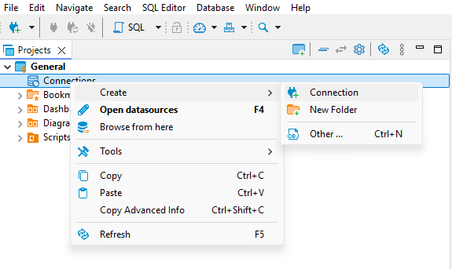
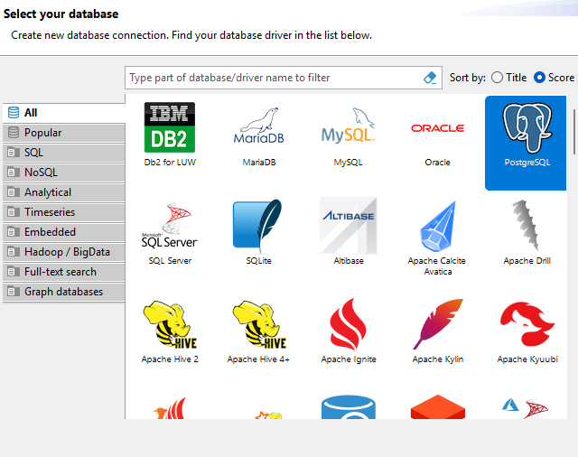
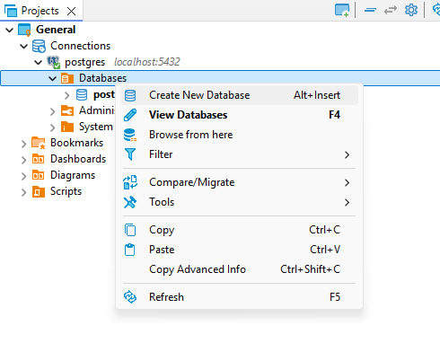
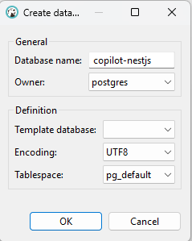
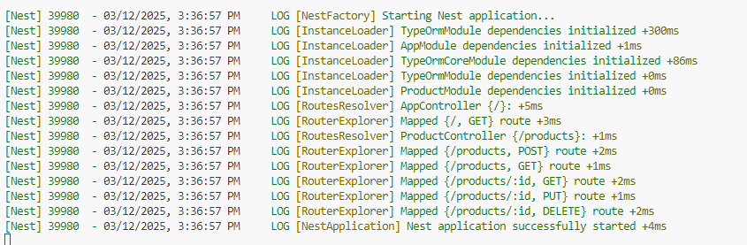
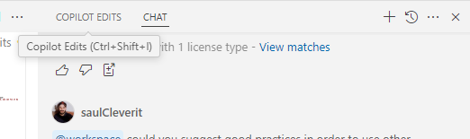
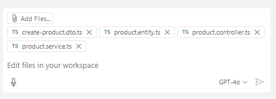
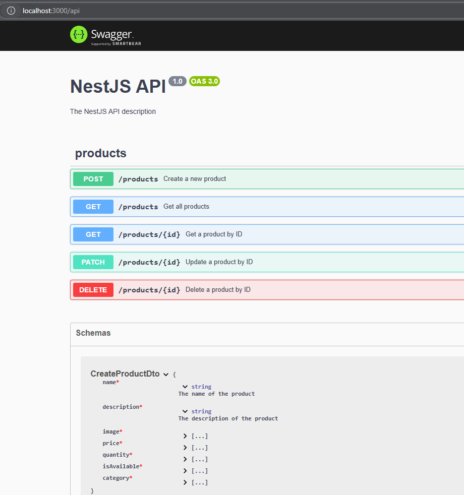

# Developing advanced solutions with Nest, Jest and Postgres (TypeORM) using GitHub Copilot.

## 💫 Overview

In this hands-on project, we will develop a NestJS application integrated with a PostgreSQL database using TypeORM. The project will cover setting up the NestJS configuration with an `.env` file, establishing a connection to the PostgreSQL database, and implementing CRUD operations. Additionally, we will enhance the project with Swagger documentation, utilize Azure Open AI for better product descriptions, and create comprehensive unit tests using Jest.

## 🎯️ Objectives

- Using GitHub Copilot in the CLI to create a PostgreSQL container.
- Setting up the Nest Config using .env file.
- Connect to Postgres Database using TypeORM.
- Create Seeder file to populate the database.
- Create Update and Delete Methods.
- Create a Better description of the products using Azure Open AI.
- Add Swagger Documentation.
- Create README.md file with Developer Docs of the project.
- Export Chat to Developer Docs.
- Create Unit Testing for Services

## 🛠️ Installation requirements

- VS Code
- Docker for Desktop
- Node Installed (nvm optional)
- GitHub CLI + GitHub Copilot Extension Enabled
- Insomnia or Postman or any Rest Client Installed.
- DBeaver or any Database Client Installed.

## ℹ️ Copilot Instructions

In this activity, we will be using copilot instructions to personalize and enhance the chat responses by providing contextual information through a repository file, improving the quality and relevance of Copilot's assistance.

```
For this Nest JS project, we will use @nestjs/typeorm for persistence and Postgres as the database, so please take this into account when answering the questions.

We will also use the @nestjs/swagger module to generate API documentation.

We will use class-validator and class-transformer to validate and transform the data.

We will use '@nestjs/testing' for testing. Generate tests for the services and controllers when you are asked to write tests using the jest framework.

Do not use `any` to define the types of the variables.

Use dependency versions that are compatible with the current version of this Nest JS project.

Use modules to organize the code and separate concerns.

Use `uuid` to generate the IDs and use the `uuid` version 4 standard.
```

## Before you start

1. **Clone the repository**

   ```bash
   git clone https://github.com/CleveritDemo/copilot-nestjs
   ```

2. **Navigate to the project directory**

   ```bash
   cd copilot-nestjs
   ```

3. **Install the dependencies**

   ```bash
   npm install
   ```

## 🖥️ Step-by-step

### 1. Create Products Module

👤 Prompt:

```bash
@workspace How to Create an entity called products, this entity has 4 attributes, id: string, name: string, description: string, image: string. Also generate the service with basic CRUD operations and the necessary DTOs.
```

🤖 Response:

Copilot should respond with the following code:

**Install necessary dependencies**:

```bash
npm install @nestjs/typeorm typeorm pg class-validator class-transformer uuid
```

**Create the Product entity**: Create a file product.entity.ts in the src/products/entities directory.

```typescript
import { Entity, Column, PrimaryGeneratedColumn } from 'typeorm';

@Entity()
export class Product {
  @PrimaryGeneratedColumn('uuid')
  id: string;

  @Column()
  name: string;

  @Column()
  description: string;

  @Column()
  image: string;
}
```

**Create the Product DTOs**:

Create a file `create-product.dto.ts` in the src/products/dto directory.

```typescript
import { IsString } from 'class-validator';

export class CreateProductDto {
  @IsString()
  name: string;

  @IsString()
  description: string;

  @IsString()
  image: string;
}
```

Create a file `update-product.dto.ts` in the src/products/dto directory.

```typescript
import { CreateProductDto } from './create-product.dto';

export class UpdateProductDto extends CreateProductDto {}
```

#### ⚠️ Troubleshooting

If you encounter this error: `Cannot find module '@nestjs/mapped-types' or its corresponding type declarations.` in the `update-product.dto.ts` file, you can fix it by asking Copilot to provide a solution using the `fix using copilot` command or removing the import statement.

**Solution**:

**Install the @nestjs/swagger** or **remove the import statement** from the `update-product.dto.ts` file.

```typescript
import { CreateProductDto } from './create-product.dto';
export class UpdateProductDto extends CreateProductDto {}
```

**Create a `product.service.ts` file** in the src/products directory.

```typescript
import { Injectable } from '@nestjs/common';
import { InjectRepository } from '@nestjs/typeorm';
import { Repository } from 'typeorm';
import { Product } from './entities/product.entity';
import { CreateProductDto } from './dto/create-product.dto';
import { UpdateProductDto } from './dto/update-product.dto';

@Injectable()
export class ProductService {
  constructor(
    @InjectRepository(Product)
    private productRepository: Repository<Product>,
  ) {}

  create(createProductDto: CreateProductDto): Promise<Product> {
    const product = this.productRepository.create(createProductDto);
    return this.productRepository.save(product);
  }

  findAll(): Promise<Product[]> {
    return this.productRepository.find();
  }

  findOne(id: string): Promise<Product> {
    return this.productRepository.findOneBy({ id });
  }

  async update(
    id: string,
    updateProductDto: UpdateProductDto,
  ): Promise<Product> {
    await this.productRepository.update(id, updateProductDto);
    return this.productRepository.findOneBy({ id });
  }

  async remove(id: string): Promise<void> {
    await this.productRepository.delete(id);
  }
}
```

#### ⚠️ Troubleshooting

If you encounter this error: `Type 'Product | null' is not assignable to type 'Product'.
  Type 'null' is not assignable to type 'Product'.` in the `product.service.ts` file, you can fix it by asking Copilot to provide a solution using the `fix using copilot` command.

**Solution**:

```typescript
  async findOne(id: string): Promise<Product> {
    const product = await this.productRepository.findOneBy({ id });
    if (!product) {
      throw new NotFoundException(`Product with ID ${id} not found`);
    }
    return product;
  }
```

make sure to import NotFoundException from `@nestjs/common`.

**Create the `product.controller.ts` file** in the src/products directory.

```typescript
import {
  Controller,
  Get,
  Post,
  Body,
  Param,
  Delete,
  Put,
} from '@nestjs/common';
import { ProductService } from './product.service';
import { CreateProductDto } from './create-product.dto';
import { UpdateProductDto } from './update-product.dto';
import { Product } from './product.entity';

@Controller('products')
export class ProductController {
  constructor(private readonly productService: ProductService) {}

  @Post()
  create(@Body() createProductDto: CreateProductDto): Promise<Product> {
    return this.productService.create(createProductDto);
  }

  @Get()
  findAll(): Promise<Product[]> {
    return this.productService.findAll();
  }

  @Get(':id')
  findOne(@Param('id') id: string): Promise<Product> {
    return this.productService.findOne(id);
  }

  @Put(':id')
  update(
    @Param('id') id: string,
    @Body() updateProductDto: UpdateProductDto,
  ): Promise<Product> {
    return this.productService.update(id, updateProductDto);
  }

  @Delete(':id')
  remove(@Param('id') id: string): Promise<void> {
    return this.productService.remove(id);
  }
}
```

**Create the Product module**: Create a file `product.module.ts` in the src/products directory.

```typescript
import { Module } from '@nestjs/common';
import { TypeOrmModule } from '@nestjs/typeorm';
import { ProductService } from './product.service';
import { ProductController } from './product.controller';
import { Product } from './product.entity';

@Module({
  imports: [TypeOrmModule.forFeature([Product])],
  providers: [ProductService],
  controllers: [ProductController],
})
export class ProductModule {}
```

**Update the App module**: Update the `app.module.ts` file in the src directory.

```typescript
import { Module } from '@nestjs/common';
import { TypeOrmModule } from '@nestjs/typeorm';
import { ProductModule } from './products/product.module';
import { AppController } from './app.controller';
import { AppService } from './app.service';

@Module({
  imports: [
    TypeOrmModule.forRoot({
      type: 'postgres',
      host: 'localhost',
      port: 5432,
      username: 'your_username',
      password: 'your_password',
      database: 'your_database',
      entities: [__dirname + '/**/*.entity{.ts,.js}'],
      synchronize: true,
    }),
    ProductModule,
  ],
  controllers: [AppController],
  providers: [AppService],
})
export class AppModule {}
```

### 2. Create a PostgreSQL container using Copilot in the CLI

👤 Prompt:

```bash
gh copilot suggest "how to run a postgres using docker in my local"
```

🤖 Response:

```bash
docker run --name postgres-local -e POSTGRES_PASSWORD=mysecretpassword -d -p 5432:5432 postgres
```

#### Check Database Connection

- Use DBeaver or any database client to connect to the server and create a new database called `copilot-nestjs`.






After filling out the form, click on the `Test Connection` button to check if the connection is successful. Then click on the `Finish` button to create the connection.





**Update the `app.module.ts` file** in the src directory.

```typescript
import { Module } from '@nestjs/common';
import { TypeOrmModule } from '@nestjs/typeorm';
import { ProductModule } from './products/product.module';
import { AppController } from './app.controller';
import { AppService } from './app.service';

@Module({
  imports: [
    TypeOrmModule.forRoot({
      type: 'postgres',
      host: 'localhost',
      port: 5432,
      username: 'postgres',
      password: 'mysecretpassword',
      database: 'copilot-nestjs',
      entities: [__dirname + '/**/*.entity{.ts,.js}'],
      synchronize: true,
    }),
    ProductModule,
  ],
  controllers: [AppController],
  providers: [AppService],
})
export class AppModule {}
```

### Check if application run successfully

```bash
npm run start:dev
```

If everything is working fine, you should see the following output:



### 3. Setting Nest Config using .env file

In this step, we will ask GitHub Copilot to provide the necessary code to set up the NestJS configuration to avoid hardcoding the database connection details in the `app.module.ts` file.

👤Prompt:

```plaintext
@workspace could you suggest good practices in order to use other approach to don't harcode the env-vars in #file:app.module.ts using @nestjs/config?
```

🤖Response:

GitHub Copilot should provide the following:

**Install necessary dependencies**:

```bash
npm install @nestjs/config
```

**Create a .env file**: Create a `.env` file in the root directory of the project

```
DATABASE_HOST=localhost
DATABASE_PORT=5432
DATABASE_USERNAME=postgres
DATABASE_PASSWORD=mysecretpassword
DATABASE_NAME=copilot-nestjs
```

ℹ️ Make sure to replace the values with your database connection details.

**Update the `app.module.ts` file** in the src directory.

```typescript
import { Module } from '@nestjs/common';
import { ConfigModule, ConfigService } from '@nestjs/config';
import { TypeOrmModule } from '@nestjs/typeorm';
import { ProductModule } from './products/product.module';

@Module({
  imports: [
    ConfigModule.forRoot({
      isGlobal: true,
    }),
    TypeOrmModule.forRootAsync({
      imports: [ConfigModule],
      useFactory: (configService: ConfigService) => ({
        type: 'postgres',
        host: configService.get<string>('DATABASE_HOST'),
        port: configService.get<number>('DATABASE_PORT'),
        username: configService.get<string>('DATABASE_USERNAME'),
        password: configService.get<string>('DATABASE_PASSWORD'),
        database: configService.get<string>('DATABASE_NAME'),
        entities: [__dirname + '/**/*.entity{.ts,.js}'],
        synchronize: true,
      }),
      inject: [ConfigService],
    }),
    ProductModule,
  ],
  controllers: [AppController],
  providers: [AppService],
})
export class AppModule {}
```

**Update the `main.ts` file** in the src directory.

```typescript
import { NestFactory } from '@nestjs/core';
import { AppModule } from './app.module';
import { ConfigService } from '@nestjs/config';

async function bootstrap() {
  const app = await NestFactory.create(AppModule);
  const configService = app.get(ConfigService);
  const port = configService.get<number>('PORT') || 3000;
  await app.listen(port);
}

bootstrap();
```

Run the application again to check if the configuration is working correctly.

### 4. Copilot Edits ⭐

ℹ️ Copilot Edits allows for fast, AI-powered code changes across files using natural language. Edits are applied directly in the editor for in-place review.

In this step, we will ask GitHub Copilot to provide the necessary code to add new fields to the product entity using Copilot Edits.

To use Copilot Edits, click in the Copilot Edits option in the top left corner of the GitHub Copilot Chat



Once you have opened Copilot Edits, add the following files to the Copilot Edits:
`create-product.dto.ts`, `product.entity.ts`, `product.service.ts`, `product.controller.ts`



Then, send the following prompt:

👤Prompt:

```plaintext
Add new fields to the product entity: price: number, quantity: number, isAvailable: boolean and category: string.
```

After sending the prompt, GitHub Copilot will provide the necessary code changes to add the new fields to the necessary files.

ℹ️ If GitHub Copilot did not provide the Update and Delete methods in the `product.service.ts` file, you can use Copilot Edits, just add `product.service.ts` and `product.controller.ts` to the Copilot Edits and send the following prompt:

👤Prompt:

```plaintext
Add the Update and Delete methods.
```

### 5. Create a Seeder File to Populate the Database

In this step, we will ask **GitHub Copilot Chat** to provide the necessary code to create a seeder file that will populate the database with sample data using @faker-js/faker.

👤Prompt:

```plaintext
@workspace How to create a product seeder service to populate the database with sample product data using @faker-js/faker and onModuleInit? Use the product service file #file:product.service.ts in the new product seeder service
```

🤖Response:

GitHub Copilot should provide the following:

**Install necessary dependencies**:

```bash
npm install @faker-js/faker
```

**Create the Product Seeder Service**: Create a file `product-seeder.service.ts` in the src/products directory.

```typescript
import { Injectable, OnModuleInit } from '@nestjs/common';
import { ProductService } from './product.service';
import { CreateProductDto } from './dto/create-product.dto';
import { faker } from '@faker-js/faker';

@Injectable()
export class ProductSeederService implements OnModuleInit {
  constructor(private readonly productService: ProductService) {}

  async onModuleInit() {
    await this.seedProducts();
  }

  async seedProducts() {
    const products: CreateProductDto[] = [];

    for (let i = 0; i < 10; i++) {
      products.push({
        name: faker.commerce.productName(),
        description: faker.commerce.productDescription(),
        image: faker.image.urlLoremFlickr(),
        price: parseFloat(faker.commerce.price()),
        quantity: faker.number.int({ min: 1, max: 100 }),
        isAvailable: faker.datatype.boolean(),
        category: faker.commerce.department(),
      });
    }

    for (const product of products) {
      await this.productService.create(product);
    }
  }
}
```

**Add condition to the `product-seeder.service.ts` file** to avoid seeding the database if there are already products in the database.

Use GitHub Copilot Inline Chat (ctrl + i) to ask Copilot to provide a solution to this problem.

Open the `product-seeder.service.ts` and select the `seedProducts` function and press `ctrl + i` to ask Copilot for a solution.

👤 Prompt:

```
Add a condition to only seed the products if the table is empty
```

```typescript
  async seedProducts() {
    const existingProducts = await this.productService.findAll();
    if (existingProducts.length > 0) {
      return;
    }

    const products: CreateProductDto[] = [];

    for (let i = 0; i < 10; i++) {
      products.push({
        name: faker.commerce.productName(),
        description: faker.commerce.productDescription(),
        image: faker.image.urlLoremFlickr(),
        price: parseFloat(faker.commerce.price()),
				quantity: faker.number.int({ min: 1, max: 100 }),
				isAvailable: faker.datatype.boolean(),
				category: faker.commerce.department(),
      });
    }

    for (const product of products) {
      await this.productService.create(product);
    }
  }
```

#### ⚠️ Troubleshooting

If you encounter this error: `Property 'imageUrl' does not exist on type 'ImageModule'.` you can fix it by asking Copilot to provide a solution using the `fix using copilot` command or by reviewing the faker-js documentation. https://fakerjs.dev/api/image.html

Solution:

```typescript
  image: faker.image.urlLoremFlickr(),
```

**Update the Product Module**: Update the `product.module.ts` file in the src/products directory.

```typescript
import { Module } from '@nestjs/common';
import { TypeOrmModule } from '@nestjs/typeorm';
import { ProductService } from './product.service';
import { ProductController } from './product.controller';
import { Product } from './entities/product.entity';
import { ProductSeederService } from './product-seeder.service';

@Module({
  imports: [TypeOrmModule.forFeature([Product])],
  providers: [ProductService, ProductSeederService],
  controllers: [ProductController],
})
export class ProductModule {}
```

This will create a product seeder service that populates the database with sample product data using @faker-js/faker when the module is initialized. You can now run the application and check if the products are seeded successfully.

### 6. Generate Unit Tests for Services

In this step, we will ask **GitHub Copilot Chat** to provide the necessary code to generate unit tests for the product service

Open the `product.service.ts` file in the src/products directory and select the `findAll` function and send the following prompt to Copilot Chat.

👤Prompt:

```plaintext
@workspace /tests Generate unit tests for #selection
```

GitHub Copilot will provide the necessary code to generate the unit tests for the `findAll` function in the product service.

Now you can generate the unit tests for findOne function in the product service by following the same steps.

🤖 Response:

```typescript
import { Test, TestingModule } from '@nestjs/testing';
import { getRepositoryToken } from '@nestjs/typeorm';
import { Repository } from 'typeorm';
import { ProductService } from './product.service';
import { Product } from './entities/product.entity';
import { NotFoundException } from '@nestjs/common';

describe('ProductService', () => {
  let service: ProductService;
  let repository: Repository<Product>;

  beforeEach(async () => {
    const module: TestingModule = await Test.createTestingModule({
      providers: [
        ProductService,
        {
          provide: getRepositoryToken(Product),
          useClass: Repository,
        },
      ],
    }).compile();

    service = module.get<ProductService>(ProductService);
    repository = module.get<Repository<Product>>(getRepositoryToken(Product));
  });

  describe('findAll', () => {
    it('should return an array of products', async () => {
      const products: Product[] = [
        {
          id: '1',
          name: 'Product 1',
          description: 'Description 1',
          image: 'Image 1',
        },
        {
          id: '2',
          name: 'Product 2',
          description: 'Description 2',
          image: 'Image 2',
        },
      ];

      jest.spyOn(repository, 'find').mockResolvedValue(products);

      expect(await service.findAll()).toBe(products);
    });
  });

  describe('findOne', () => {
    it('should return a product if found', async () => {
      const product: Product = {
        id: '1',
        name: 'Product 1',
        description: 'Description 1',
        image: 'Image 1',
      };

      jest.spyOn(repository, 'findOneBy').mockResolvedValue(product);

      expect(await service.findOne('1')).toBe(product);
    });

    it('should throw a NotFoundException if product not found', async () => {
      jest.spyOn(repository, 'findOneBy').mockResolvedValue(null);

      await expect(service.findOne('1')).rejects.toThrow(
        new NotFoundException(`Product with ID 1 not found`),
      );
    });
  });
});
```

Save the file in the `src/products` directory as `product.service.spec.ts`.

**Homework**: Generate unit tests for the remaining functions in the product service by following the same steps.

#### ⚠️ Troubleshooting

If the unit test fail for the `findOne` method. This can be fixed by selecting the error message on the VSCode terminal, and using the `/fix` command with the following shortcuts: 
```plaintext
@workspace /fix #terminalLastCommand #terminalSelection
```

Solution: Add this line of code at the end of the `beforeEach` function
```js

beforeEach(async () => {
	/* Rest of the code...*/
	jest.clearAllMocks(); // Clear any previous calls to mocks
});
```

### 7. Add Swagger Documentation

In this step, we will ask GitHub Copilot to provide the necessary code to add Swagger documentation to the NestJS application.

👤Prompt:

```plaintext
@workspace Could you suggest how to add swagger documentation to the project?
```

🤖Response:

GitHub Copilot should provide the following:

**Install necessary dependencies**:

```bash
npm install @nestjs/swagger swagger-ui-express
```

Create a Swagger configuration file, for example, swagger.config.ts in the src directory.

```typescript
// filepath: src/swagger.config.ts
import { DocumentBuilder, SwaggerModule } from '@nestjs/swagger';
import { INestApplication } from '@nestjs/common';

export function setupSwagger(app: INestApplication): void {
  const config = new DocumentBuilder()
    .setTitle('NestJS API')
    .setDescription('The NestJS API description')
    .setVersion('1.0')
    .build();

  const document = SwaggerModule.createDocument(app, config);
  SwaggerModule.setup('api', app, document);
}
```

**Update the `main.ts` file** in the src directory to include the Swagger configuration.

```typescript
// filepath: src/main.ts
import { NestFactory } from '@nestjs/core';
import { AppModule } from './app.module';
import { ConfigService } from '@nestjs/config';
import { setupSwagger } from './swagger.config';

async function bootstrap() {
  const app = await NestFactory.create(AppModule);
  const configService = app.get(ConfigService);
  const port = configService.get<number>('PORT') || 3000;

  setupSwagger(app);

  await app.listen(port);
}

bootstrap().catch((err) => {
  console.error('Error during bootstrap:', err);
});
```

Add Swagger decorators to your DTOs and controllers to generate the documentation

example:

```typescript
// filepath: src/products/product.controller.ts
import { ApiTags, ApiOperation, ApiResponse } from '@nestjs/swagger';

  @Post()
  @ApiOperation({ summary: 'Create a new product' })
  @ApiResponse({ status: 201, description: 'The product has been successfully created.', type: Product })
  create(@Body() createProductDto: CreateProductDto): Promise<Product> {
    return this.productService.create(createProductDto);
  }

```

Then run the application and navigate to `http://localhost:3000/api` to view the Swagger documentation.



### 8. Create a Better Description of the Products using Azure Open AI (Optional)

ℹ️ Make sure to have an Azure Open AI API key to use this feature.

We are going to use the translate and refactor characteristics of GitHub Copilot to translate a call made in python to NodeJS.

👤Prompt:

```plaintext
@workspace translate this implementation #file:openai-call.md  to node (nestjs) using @nestjs/axios. Create a service to generate a product description. This mus be implemented in the find one method of the #file:product.service.ts
```

🤖Response:

GitHub Copilot should provide the following:

**Install necessary dependencies**:

```bash
npm install @nestjs/axios axios
```

Create a file `openai.service.ts` in the src/products directory.

```typescript
// filepath: src/products/openai.service.ts
import { Injectable, InternalServerErrorException } from '@nestjs/common';
import { HttpService } from '@nestjs/axios';
import { firstValueFrom } from 'rxjs';

@Injectable()
export class OpenAIService {
  constructor(private readonly httpService: HttpService) {}

  async generateProductDescription(productName: string): Promise<string> {
    const headers = {
      'Content-Type': 'application/json',
      'api-key': process.env.OPENAI_API_KEY,
    };

    const params = {
      'api-version': '2024-02-15-preview',
    };

    const json_data = {
      messages: [
        {
          role: 'system',
          content:
            'You are an AI wizard that helps people create product descriptions.',
        },
        {
          role: 'user',
          content: productName,
        },
      ],
      max_tokens: 800,
      temperature: 0.7,
      frequency_penalty: 0,
      presence_penalty: 0,
      top_p: 0.95,
      stop: null,
    };

    try {
      const response = await firstValueFrom(
        this.httpService.post(
          'https://clever-dev-openai.openai.azure.com/openai/deployments/chat/chat/completions',
          json_data,
          { headers, params },
        ),
      );
      return response.data.choices[0].message.content;
    } catch (error) {
      throw new InternalServerErrorException(
        'Failed to generate product description',
      );
    }
  }
}
```

Update the `findOne` method in the `product.service.ts` file to use the OpenAIService.

```typescript
  async findOne(id: string): Promise<Product> {
    const product = await this.productRepository.findOneBy({ id });
    if (!product) {
      throw new NotFoundException(`Product with ID ${id} not found`);
    }

    const description = await this.openAIService.generateProductDescription(product.name);
    product.description = description;

    return product;
  }
```

**Update the `product.module.ts` file** in the src/products directory to include the OpenAIService.

```typescript
@Module({
  imports: [TypeOrmModule.forFeature([Product]), HttpModule],
  providers: [ProductService, ProductSeederService, OpenAIService],
  controllers: [ProductController],
})
export class ProductModule {}
```

⚠️ Make sure to import the HttpModule from `@nestjs/axios` in the `product.module.ts` file.

#### ⚠️ Troubleshooting

If you encounter this error: `Unsafe return of a value of type `any`in the`openai.service.ts` file

Select the code and send the following prompt to Copilot Chat to fix the issue:

👤 Prompt:

```plaintext
I'm getting Unsafe return of a value of type any #selection
```

🤖 Response:

```typescript
// filepath: src/products/openai.service.ts
import { Injectable, InternalServerErrorException } from '@nestjs/common';
import { HttpService } from '@nestjs/axios';
import { firstValueFrom } from 'rxjs';

interface OpenAIResponse {
  choices: {
    message: {
      content: string;
    };
  }[];
}

@Injectable()
export class OpenAIService {
  constructor(private readonly httpService: HttpService) {}

  async generateProductDescription(productName: string): Promise<string> {
    const headers = {
      'Content-Type': 'application/json',
      'api-key': process.env.OPENAI_API_KEY,
    };

    const params = {
      'api-version': '2024-02-15-preview',
    };

    const json_data = {
      messages: [
        {
          role: 'system',
          content:
            'You are an AI wizard that helps people create product descriptions.',
        },
        {
          role: 'user',
          content: productName,
        },
      ],
      max_tokens: 800,
      temperature: 0.7,
      frequency_penalty: 0,
      presence_penalty: 0,
      top_p: 0.95,
      stop: null,
    };

    try {
      const response = await firstValueFrom(
        this.httpService.post<OpenAIResponse>(
          'https://clever-dev-openai.openai.azure.com/openai/deployments/chat/chat/completions',
          json_data,
          { headers, params },
        ),
      );
      return response.data.choices[0].message.content;
    } catch (error) {
      throw new InternalServerErrorException(
        'Failed to generate product description',
      );
    }
  }
}
```

### 9. Create README.md file with Developer Docs of the project

In this step, we will ask GitHub Copilot to provide the necessary code to create a README.md file with developer documentation for the project.

👤Prompt:

```plaintext
@workspace Could you suggest how to create a README.md file with developer documentation for the project?
```

### 10. Export GitHub Copilot Chat to Developer Docs

In this step, we will ask GitHub Copilot to provide the necessary code to export the chat to the developer documentation. This is useful for capturing the conversation and context around the development process.

1. Press ctrl + shift + p to open the command palette.
2. Type "Export Chat"
3. Select the option to export the chat.
4. Save the exported chat.
