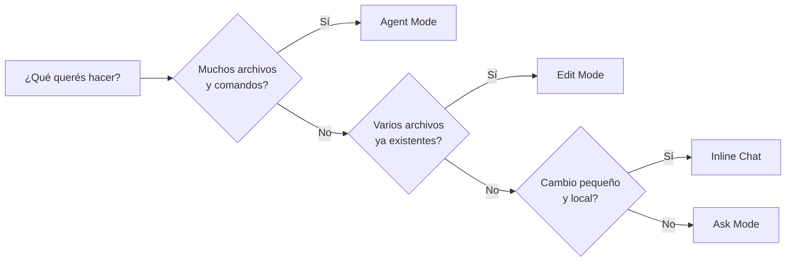
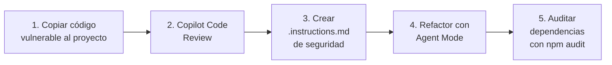

<div align="center">

  # 🚀 Copilot para NestJS: Del Prompt al Código Seguro

  ### Workshop práctico de GitHub Copilot para desarrolladores NestJS

  [](https://github.com/features/copilot)
  [](https://nestjs.com/)
  [](https://www.typescriptlang.org/)
  [](https://jestjs.io/)
  [](https://owasp.org/Top10/)

  🇪🇸 **Español (Latinoamérica)** · [🇺🇸 English](./README_EN.md)

</div>

---

**Esta capacitación práctica** te enseña a aprovechar **GitHub Copilot** en un flujo real de desarrollo **NestJS**: desde las distintas superficies de interacción (completions, NES, Inline Chat, Chat con modos Ask/Edit/Agent, Copilot CLI y Code Review), pasando por técnicas para **mejorar la calidad** de las respuestas con contexto e instrucciones personalizadas, hasta **generar código**, **crear pruebas unitarias** y **detectar y mitigar vulnerabilidades** de seguridad.

> 📚 Documentación oficial de las herramientas usadas en este taller:
>
> - [GitHub Copilot Chat](https://docs.github.com/en/copilot/how-tos/use-copilot-chat)
> - [Custom instructions & prompt files](https://docs.github.com/en/copilot/customizing-copilot)
> - [NestJS Documentation](https://docs.nestjs.com/)
> - [Jest Testing Framework](https://jestjs.io/docs/getting-started)
> - [OWASP Top 10 (2021)](https://owasp.org/Top10/)
> - [Copilot Code Review](https://docs.github.com/en/copilot/using-github-copilot/code-review)

---

## 📋 Tabla de Contenidos

1. [🚀 Preparar el laboratorio](#-preparar-el-laboratorio)
2. [🎛️ Paso 1. Métodos de Interacción de GitHub Copilot](#️-paso-1-métodos-de-interacción-de-github-copilot)
3. [🧭 Paso 2. Mejorar las Interacciones con Contexto y Personalización](#-paso-2-mejorar-las-interacciones-con-contexto-y-personalización)
4. [🛠️ Paso 3. Generación de Código y Refactoring](#️-paso-3-generación-de-código-y-refactoring)
   - [3.1 Crear el módulo `products` (Agent Mode)](#31-crear-el-módulo-products-agent-mode)
   - [3.2 Añadir un campo cross-file (Edit Mode)](#32-añadir-un-campo-cross-file-edit-mode)
   - [3.3 Refactor puntual (Inline Chat)](#33-refactor-puntual-inline-chat)
   - [3.4 Traducir código externo (opcional)](#34-traducir-código-externo-opcional)
5. [🧪 Paso 4. Creación de Pruebas Unitarias con Jest](#-paso-4-creación-de-pruebas-unitarias-con-jest)
6. [🛡️ Paso 5. Detección y Mitigación de Vulnerabilidades](#️-paso-5-detección-y-mitigación-de-vulnerabilidades)

---

## ⏱️ Duración estimada

| Bloque                                                     | Tiempo      |
| ---------------------------------------------------------- | ----------- |
| 🚀 Preparación del laboratorio                             | 5 min       |
| 🎛️ Paso 1 — Métodos de Interacción                         | 10 min      |
| 🧭 Paso 2 — Mejorar las Interacciones                      | 10 min      |
| 🛠️ Paso 3 — Generación de Código y Refactoring             | 15 min      |
| 🧪 Paso 4 — Pruebas Unitarias                              | 10 min      |
| 🛡️ Paso 5 — Detección y Mitigación de Vulnerabilidades     | 10 min      |
| **Total**                                                  | **~60 min** |

---

## 🎯 Objetivos de aprendizaje

Al finalizar este workshop serás capaz de:

- ✅ Identificar y usar las distintas **superficies de interacción** de Copilot (completions, NES, Inline Chat, Ask/Edit/Agent, Copilot CLI, Code Review) y saber cuál elegir para cada tarea.
- ✅ Elevar la calidad de las respuestas con **variables de contexto** (`#codebase`, `#file`, `#problems`, `#terminalLastCommand`…), **selección de modelo**, **custom instructions** (`.github/copilot-instructions.md`, `*.instructions.md` con `applyTo`), **prompt files** (`*.prompt.md`) y **chat modes** personalizados.
- ✅ Construir un módulo NestJS completo (entity, DTOs, service, controller, module) con **Agent Mode**, extenderlo con **Edit Mode** y pulirlo con **Inline Chat**.
- ✅ Generar pruebas unitarias con Jest y `@nestjs/testing` usando `/tests`, y **arreglar tests fallidos** con Agent Mode + `#terminalLastCommand` + `#problems`.
- ✅ Detectar vulnerabilidades comunes del **OWASP Top 10** con **Copilot Code Review** y aplicar mitigaciones concretas guiadas por instrucciones de seguridad reutilizables.

---

## 📚 Requisitos previos

Antes de comenzar, asegurate de tener:

- [Visual Studio Code](https://code.visualstudio.com/) (última versión estable).
- Extensiones **GitHub Copilot** y **GitHub Copilot Chat** instaladas y activadas.
- Cuenta con **suscripción activa** de GitHub Copilot (Free, Pro, Business o Enterprise).
- [Node.js 20 LTS o superior](https://nodejs.org/) (recomendado 22 LTS).
- [Git](https://git-scm.com/downloads).
- [GitHub CLI](https://cli.github.com/) con la extensión **Copilot CLI**:

  ```bash
  gh extension install github/gh-copilot
  ```

- (Opcional) [Docker Desktop](https://www.docker.com/products/docker-desktop/) si querés persistir datos en Postgres para los ejercicios avanzados.

Verificá tu instalación:

```bash
node --version
npm --version
git --version
code --version
gh copilot --version
```

---

## 🚀 Preparar el laboratorio

### 1. Clonar el repo y cambiar a la rama del workshop

```bash
git clone https://github.com/CleveritDemo/copilot-nestjs
cd copilot-nestjs
git checkout updated-main
```

### 2. Instalar dependencias

```bash
npm install
```

### 3. Abrir en VS Code

```bash
code .
```

### 4. Validar que Copilot responde

Abrí la vista Chat (`Ctrl+Alt+I` en Windows/Linux · `Cmd+Ctrl+I` en macOS) y probá:

```text
Hola Copilot, listá los scripts de npm disponibles en este proyecto usando #codebase.
```

Si obtenés respuesta, todo está listo. Si no, inicia sesión desde la paleta de comandos con **GitHub: Sign in**.

### 5. (Opcional) Levantar Postgres

Sólo si vas a hacer los ejercicios que requieren base de datos real:

```bash
docker run --name postgres-workshop `
  -e POSTGRES_PASSWORD=workshop `
  -e POSTGRES_DB=copilot-nestjs `
  -p 5432:5432 -d postgres:16
```

> [!NOTE]
> El bloque anterior usa continuación de línea de PowerShell (backtick `` ` ``). En bash/zsh reemplazá los backticks por `\`.

### 6. Familiarizate con el selector de modelo

En la parte inferior de la caja de chat vas a ver el **selector de modelo**. Confirmá que podés elegir entre los modelos que ofrece tu plan (por ejemplo Claude Sonnet, GPT-5, o razonadores). Usaremos varios durante el workshop.

> [!TIP]
> Para tareas de generación grande o refactor complejo, elegí un modelo grande. Para completions y edits pequeños, un modelo rápido rinde mejor.

---

## 🎛️ Paso 1. Métodos de Interacción de GitHub Copilot

**Objetivo:** conocer cada superficie de interacción de Copilot y cuándo usar cada una.

### 1.1 Panorama general

GitHub Copilot ya no es sólo autocompletado. Hoy expone múltiples superficies, cada una optimizada para un contexto distinto:

| Superficie                          | Atajo / Ubicación                                     | Cuándo usarla                                                                       |
| ----------------------------------- | ----------------------------------------------------- | ----------------------------------------------------------------------------------- |
| **Code Completions** (ghost text)   | Sugerencia automática al escribir; `Tab` para aceptar | Escribís código y querés autocompletar líneas o bloques.                            |
| **Next Edit Suggestions (NES)**    | Aparece tras una edición; `Tab` para saltar/aceptar   | Copilot predice la siguiente edición relacionada.                                   |
| **Inline Chat**                     | `Ctrl+I` / `Cmd+I` sobre la selección o cursor        | Modificar código concreto sin salir del editor.                                     |
| **Chat View — modo Ask**            | Vista Chat, selector *Ask*                            | Preguntas conceptuales, exploración, *"¿cómo funciona esto?"*.                      |
| **Chat View — modo Edit**           | Vista Chat, selector *Edit*                           | Editar varios archivos a la vez con vista previa antes de aplicar.                  |
| **Chat View — modo Agent**          | Vista Chat, selector *Agent*                          | Tareas multi-paso donde Copilot lee, edita, ejecuta comandos y corre tests.         |
| **Quick Chat**                      | `Ctrl+Shift+I` / `Cmd+Shift+I`                        | Pregunta rápida sin abrir el panel completo.                                        |
| **Smart Actions** (menú contextual) | Clic derecho → *Copilot*                              | Acciones: *Explain*, *Fix*, *Review*, *Generate Docs*, *Generate Tests*.            |
| **Copilot CLI**                     | Terminal: `gh copilot suggest` / `explain`            | Sugerencia y explicación de comandos de shell.                                      |
| **Copilot Code Review**             | Botón *Review* en chat o en un PR                     | Revisión asistida de un diff antes de commitear/mergear.                            |

> [!IMPORTANT]
> **Ya no existe** el panel independiente "Copilot Edits" que aparecía en versiones anteriores. Ahora Edit es un **modo** dentro de la Chat View, junto a Ask y Agent.

### 1.2 Probá 4 superficies en orden

#### 1️⃣ Code Completions

Abrí [`src/app.service.ts`](./src/app.service.ts) y debajo de `getHello()` empezá a escribir:

```typescript
getGreeting(name: string):
```

Esperá 1 segundo. Copilot completa la firma y el cuerpo. Presioná `Tab` para aceptar.

#### 2️⃣ Next Edit Suggestions (NES)

En el mismo archivo, cambiá `getHello()` para que devuelva `'Hola Mundo!'`. Copilot detectará que probablemente querés cambiar el test en [`src/app.controller.spec.ts`](./src/app.controller.spec.ts) y te ofrecerá saltar allí. `Tab` para navegar, `Tab` para aceptar.

#### 3️⃣ Inline Chat

Seleccioná el método `getHello()` y presioná `Ctrl+I` (`Cmd+I` en macOS). Escribí:

```text
Añade un parámetro opcional `locale` que devuelva el saludo en español o inglés según el valor.
```

Revisá el diff inline y aceptá con `Enter` o descartá con `Esc`.

#### 4️⃣ Chat View — modo Ask

Abrí la Chat View (`Ctrl+Alt+I`), seleccioná **Ask** en el selector de modo y escribí:

```text
#codebase Explicame la estructura de este proyecto NestJS y qué hace cada archivo dentro de src/.
```

### 1.3 Copilot en la CLI

Desde una terminal integrada, probá:

```bash
gh copilot suggest "levantar un contenedor de postgres 16 con volumen persistente y base copilot-nestjs"
```

```bash
gh copilot explain "docker run --name pg -e POSTGRES_PASSWORD=xyz -p 5432:5432 -d postgres:16"
```

> [!TIP]
> Copilot CLI te permite **ejecutar**, **copiar** o **revisar** el comando sugerido antes de correrlo.

### 1.4 Copilot Code Review (introducción)

En la Chat View, junto al botón de enviar, hay una acción **Review**. También podés:

- Seleccionar código en el editor → clic derecho → *Copilot → Review and comment*.
- Pedir revisión del diff actual con `#changes`.

Lo usaremos a fondo en el [Paso 5 — Seguridad](#️-paso-5-detección-y-mitigación-de-vulnerabilidades).

### ✅ Checkpoint del Paso 1

- [ ] Aceptaste al menos una code completion.
- [ ] Usaste Inline Chat para modificar un método.
- [ ] Corriste un prompt en Chat View en modo Ask con `#codebase`.
- [ ] Ejecutaste `gh copilot suggest` desde la terminal.

---

## 🧭 Paso 2. Mejorar las Interacciones con Contexto y Personalización

**Objetivo:** obtener respuestas más precisas y consistentes usando variables de contexto, custom instructions, prompt files, chat modes y el selector de modelo.

### 2.1 Variables de contexto (`#…`)

Las variables `#` inyectan contexto tipado en tu prompt. Son mucho más precisas que describir el contexto con palabras.

| Variable                  | Qué inyecta                                                                    |
| ------------------------- | ------------------------------------------------------------------------------ |
| `#codebase`               | Índice semántico de todo el workspace (sustituye a `@workspace`).              |
| `#file`                   | Contenido de un archivo específico.                                            |
| `#folder`                 | Todos los archivos de una carpeta.                                             |
| `#selection`              | La selección actual del editor.                                                |
| `#problems`               | Todos los diagnósticos (errores/warnings) del workspace.                       |
| `#terminalLastCommand`    | Último comando ejecutado y su salida.                                          |
| `#terminalSelection`      | Selección actual en el panel de terminal.                                      |
| `#changes`                | Diff de los cambios Git actuales (staged + unstaged).                          |
| `#usage`                  | Referencias/definiciones de un símbolo.                                        |
| `#fetch`                  | Contenido de una URL pública.                                                  |
| `#githubRepo`             | Información de un repositorio GitHub remoto.                                   |

**Mini-ejercicio:** en modo Ask lanzá este prompt y compará la respuesta **con** y **sin** `#codebase`:

```text
Basado en #codebase, ¿qué versión de NestJS estamos usando y qué scripts npm hay disponibles?
```

### 2.2 Adjuntar archivos, carpetas e imágenes

Con el icono **📎 Add Context** (o `Ctrl+/`) podés adjuntar archivos, carpetas, símbolos, imágenes (screenshot, mockup, diagrama) y la ventana activa.

> [!TIP]
> Adjuntar imágenes funciona con modelos con visión. Ideal para *"generame el HTML/CSS de este mockup"*.

### 2.3 Selección de modelo

Usá el **selector de modelo** al pie de la caja de chat:

- **Claude Sonnet / Opus** — razonamiento largo, refactors complejos, explicaciones.
- **GPT-5 / GPT-4.1** — buen balance para generación, edición y agente.
- **o-series** (razonadores) — tareas con muchas dependencias lógicas.
- **Modelos rápidos** — completions rápidas, edits pequeños.

### 2.4 Custom Instructions

Copilot lee automáticamente instrucciones desde archivos especiales del repo. **Evita repetir el mismo prompt** una y otra vez.

#### 2.4.1 Instrucciones globales del repo

Ya existe [`.github/copilot-instructions.md`](./.github/copilot-instructions.md). Ábrelo y revísalo — Copilot lo aplicará a **cada prompt** dentro del workspace.

#### 2.4.2 Instrucciones específicas por patrón (`.instructions.md`)

Podés crear reglas más granulares que sólo se activen para ciertos archivos. Creá `.github/instructions/typescript.instructions.md`:

```markdown
---
applyTo: "**/*.ts"
---

- Usa siempre tipos explícitos en parámetros y valores de retorno de funciones exportadas.
- Prefiere `readonly` en propiedades inmutables de clases.
- Evita `enum`; usa `as const` con union types.
- Todas las importaciones deben ser relativas al alias `src/` cuando exista.
```

Copilot cargará estas reglas **sólo cuando trabajes con archivos `.ts`**.

> [!NOTE]
> El frontmatter `applyTo` acepta patrones glob. Podés tener varios archivos `.instructions.md` para distintas capas (por ejemplo `**/*.spec.ts`, `src/products/**`, etc.).

**Mini-ejercicio:** después de crear el archivo, en modo Ask pedile:

```text
#codebase Sugerí una refactorización para el AppService que respete nuestras convenciones.
```

Observá cómo la respuesta **respeta** las reglas del `.instructions.md`.

### 2.5 Prompt Files (`.prompt.md`)

Los prompt files son plantillas reutilizables. Se guardan en [`.github/prompts/`](./.github/prompts/) y aparecen como slash commands en el chat.

Este repo ya trae tres prompt files listos para usar:

| Prompt file                                                                        | Modo    | Uso                                                            |
| ---------------------------------------------------------------------------------- | ------- | -------------------------------------------------------------- |
| [`generar-crud-nestjs.prompt.md`](./.github/prompts/generar-crud-nestjs.prompt.md) | Agent   | Scaffold de un módulo NestJS completo con nombre parametrizado. |
| [`revisar-seguridad.prompt.md`](./.github/prompts/revisar-seguridad.prompt.md)     | Ask     | Auditoría OWASP Top 10 sobre el código adjunto.                |
| [`generar-tests.prompt.md`](./.github/prompts/generar-tests.prompt.md)             | Edit    | Genera specs con Jest + `@nestjs/testing`.                     |

**Cómo invocarlos:** en el chat escribí `/generar-crud-nestjs` (o el nombre del prompt) y aparecerá en el picker con sus parámetros.

### 2.6 Custom Chat Modes (`.chatmode.md`)

Podés crear **modos de chat personalizados** con un system prompt y un set de herramientas restringido. Útil para *"modo revisor de seguridad"*, *"modo mentor"*, *"modo DBA"*, etc.

Ejemplo de sintaxis (no lo crees ahora, sólo referencia) en `.github/chatmodes/security-reviewer.chatmode.md`:

```markdown
---
description: Revisor de seguridad orientado a OWASP Top 10.
tools: ['codebase', 'search', 'problems']
model: Claude Sonnet
---

Sos un experto en seguridad. Revisá el código exclusivamente desde la óptica de OWASP Top 10.
Por cada problema:
1. Describí el riesgo.
2. Mostrá un fragmento vulnerable.
3. Propone una mitigación con código concreto.
```

### 2.7 MCP (Model Context Protocol) — mención rápida

Los servidores **MCP** permiten conectar Copilot a **fuentes externas** (bases de datos, Jira, Confluence, tu propia API…) mediante `.vscode/mcp.json`. Está fuera del alcance de este workshop de 1 h, pero recordá que existe.

### ✅ Checkpoint del Paso 2

- [ ] Usaste al menos 3 variables `#…` diferentes en un prompt.
- [ ] Cambiaste el modelo activo desde el selector.
- [ ] Creaste `.github/instructions/typescript.instructions.md`.
- [ ] Invocaste al menos un prompt file como slash command.

---

## 🛠️ Paso 3. Generación de Código y Refactoring

**Objetivo:** construir un módulo NestJS completo con **Agent Mode**, extenderlo con **Edit Mode** y pulirlo con **Inline Chat**.

### Panorama de decisiones


```mermaid
flowchart LR
    A[¿Qué querés hacer?] --> B{Muchos archivos<br/>y comandos?}
    B -- Sí --> C[Agent Mode]
    B -- No --> D{Varios archivos<br/>ya existentes?}
    D -- Sí --> E[Edit Mode]
    D -- No --> F{Cambio pequeño<br/>y local?}
    F -- Sí --> G[Inline Chat]
    F -- No --> H[Ask Mode]
```

### 3.1 Crear el módulo `products` (Agent Mode)

En la Chat View, seleccioná **Agent** en el selector de modo y enviá:

```text
#codebase Crea un módulo NestJS `products` con esta estructura:

- `src/products/entities/product.entity.ts`: entity TypeORM con id (uuid v4), name, description, image, price, quantity, isAvailable, category.
- `src/products/dto/create-product.dto.ts`: DTO con validaciones de class-validator.
- `src/products/dto/update-product.dto.ts`: extiende de CreateProductDto usando `PartialType` de `@nestjs/mapped-types`.
- `src/products/products.service.ts`: CRUD completo con Repository de TypeORM. `findOne` debe lanzar `NotFoundException`.
- `src/products/products.controller.ts`: endpoints REST estándar.
- `src/products/products.module.ts`: registra el TypeOrmModule.forFeature([Product]).

Después:
1. Actualizá `src/app.module.ts` para importar `ProductsModule` y configurar `TypeOrmModule.forRoot` leyendo desde `@nestjs/config` (host, port, username, password, database desde .env).
2. Creá un `.env.example` con las variables.
3. Instalá las dependencias necesarias (`@nestjs/typeorm`, `typeorm`, `pg`, `class-validator`, `class-transformer`, `@nestjs/config`, `@nestjs/mapped-types`, `uuid`).
4. Corré `npm run build` para verificar que compila.

Respetá las reglas de #codebase (no uses `any`, usa uuid v4, etc.).
```

Agent Mode te va a mostrar **cada acción** (ejecución de comandos, creación de archivos, edición de archivos existentes) y te pedirá aprobación para las que afecten el sistema. Aprobá las que quieras aplicar.

> [!TIP]
> Podés **detener** al agente con el botón *Stop* o **pausarlo** para inspeccionar un cambio antes de que continúe.

Verificación:

```bash
npm run build
```

Si compila, el módulo está listo.

### 3.2 Añadir un campo cross-file (Edit Mode)

Vamos a añadir un campo `sku` propagándolo por varios archivos.

1. En la Chat View, cambiá al modo **Edit**.
2. Adjuntá con 📎 (o arrastrando desde el explorador):
   - `src/products/entities/product.entity.ts`
   - `src/products/dto/create-product.dto.ts`
   - `src/products/products.service.ts`
   - `src/products/products.controller.ts`
3. Enviá:

```text
Añadí un campo `sku: string` obligatorio y único al Product:

- En la entity, marcalo con `@Column({ unique: true })`.
- En el CreateProductDto, validá con `@IsString()` y `@Length(3, 32)`.
- En el service, en `create()`, si el sku ya existe, lanzá `ConflictException` de `@nestjs/common`.
- Actualizá el controller si es necesario.

No modifiques nada más.
```

Edit Mode te va a mostrar un **diff por archivo** que podés aceptar o rechazar individualmente.

### 3.3 Refactor puntual (Inline Chat)

Abrí `src/products/products.service.ts`, seleccioná el método `findOne` y presioná `Ctrl+I`:

```text
Refactorizá para que devuelva el producto con solo el `id`, `name` y `price`, usando `Pick<Product, ...>` como tipo de retorno.
```

Revisá el diff inline y aceptá con `Enter`.

### 3.4 Traducir código externo (opcional)

Podés pedirle a Copilot que traduzca código de otro lenguaje. Por ejemplo, adjuntando un snippet Python de Azure OpenAI:

En modo Edit, adjuntá `src/products/products.service.ts` y pegá el siguiente snippet como contexto:

```python
import requests

headers = {'api-key': 'YOUR_API_KEY', 'Content-Type': 'application/json'}
params = {'api-version': '2024-02-15-preview'}
json_data = {
    'messages': [
        {'role': 'system', 'content': 'You are an ai wizard that helps people create product descriptions.'},
        {'role': 'user', 'content': 'nike'},
    ],
    'max_tokens': 800,
    'temperature': 0.7,
}
response = requests.post(
    'https://YOUR-RESOURCE.openai.azure.com/openai/deployments/YOUR-DEPLOYMENT/chat/completions',
    params=params, headers=headers, json=json_data,
)
```

Y este prompt:

```text
Traducí esta llamada Python a un servicio NestJS `OpenAIService` en `src/products/openai.service.ts` usando `@nestjs/axios`.
Añadí el `OpenAIService` como dependencia del `ProductsService` e inyectalo en `findOne` para enriquecer la descripción del producto.
No hardcodees la API key: usá `ConfigService` para leerla desde `OPENAI_API_KEY`.
```

> [!IMPORTANT]
> Copilot **no debería** hardcodear la key. Si lo hace, es una oportunidad perfecta para el [Paso 5 — Seguridad](#️-paso-5-detección-y-mitigación-de-vulnerabilidades).

### ✅ Checkpoint del Paso 3

- [ ] Módulo `products` funcional (compila con `npm run build`).
- [ ] Campo `sku` propagado a entity, DTO y service.
- [ ] Refactor aplicado con Inline Chat.

---

## 🧪 Paso 4. Creación de Pruebas Unitarias con Jest

**Objetivo:** generar pruebas unitarias con Jest y `@nestjs/testing`, y usar Agent Mode para arreglar tests que fallen.

> [!NOTE]
> Requisito: haber completado el [Paso 3](#️-paso-3-generación-de-código-y-refactoring) — necesitamos el `ProductsService`.

### 4.1 Generar tests con `/tests`

1. Abrí `src/products/products.service.ts` y **seleccioná el método `findAll`**.
2. En Chat View (modo Ask o Edit) escribí:

```text
/tests Generá pruebas unitarias con Jest y @nestjs/testing para el método seleccionado. Mockeá el Repository de TypeORM con `getRepositoryToken`.
```

Copilot te propondrá el contenido de `src/products/products.service.spec.ts`:

```typescript
import { Test, TestingModule } from '@nestjs/testing';
import { getRepositoryToken } from '@nestjs/typeorm';
import { Repository } from 'typeorm';
import { ProductsService } from './products.service';
import { Product } from './entities/product.entity';

describe('ProductsService', () => {
  let service: ProductsService;
  let repository: Repository<Product>;

  beforeEach(async () => {
    const module: TestingModule = await Test.createTestingModule({
      providers: [
        ProductsService,
        {
          provide: getRepositoryToken(Product),
          useClass: Repository,
        },
      ],
    }).compile();

    service = module.get<ProductsService>(ProductsService);
    repository = module.get<Repository<Product>>(getRepositoryToken(Product));

    jest.clearAllMocks();
  });

  describe('findAll', () => {
    it('devuelve un array de productos', async () => {
      const products: Product[] = [/* ... */];
      jest.spyOn(repository, 'find').mockResolvedValue(products);
      expect(await service.findAll()).toBe(products);
    });
  });
});
```

### 4.2 Ejecutar los tests

```bash
npm test
```

Si algún test falla, **no arregles a mano**: pasá al siguiente paso.

### 4.3 Arreglar tests con Agent Mode

Cuando un test falle, la salida del terminal queda disponible en `#terminalLastCommand`. En modo **Agent**:

```text
Los tests de `products.service.spec.ts` están fallando. Usá #terminalLastCommand para diagnosticar y #problems para ver errores del compilador. Corregí los tests (no la lógica del servicio, salvo bug evidente) y volvé a ejecutar `npm test` hasta que pasen todos.
```

Agent Mode:

1. Lee el fallo.
2. Edita el spec.
3. Vuelve a ejecutar `npm test`.
4. Itera hasta pasar (o hasta que te pida ayuda).

> [!TIP]
> Si el agente entra en bucle, detenelo con **Stop** y pedile un análisis más específico usando `#file:products.service.spec.ts`.

### 4.4 Completar la cobertura

En modo Edit, con `src/products/products.service.ts` y `src/products/products.service.spec.ts` adjuntos:

```text
Completá el spec para cubrir todos los métodos del ProductsService (findOne, create, update, remove).

Incluí:
- Caso feliz de cada método.
- `findOne` cuando NO existe el producto (debe lanzar `NotFoundException`).
- `create` cuando el sku ya existe (debe lanzar `ConflictException`).
- `update` cuando el id no existe.
- `remove` cuando el id no existe.

Seguí el estilo del spec actual y respetá las reglas de #codebase.
```

Verificá:

```bash
npm run test:cov
```

Con este flujo deberías llegar a **cobertura cercana al 100%** en el service.

### 4.5 Bonus — Tests para el Controller

Con el mismo enfoque, adjuntá `src/products/products.controller.ts` y pedí:

```text
Generá `src/products/products.controller.spec.ts` mockeando el `ProductsService` con `jest.fn()`.
Cubrí todos los endpoints y verificá que se propaguen las excepciones del service.
```

### ✅ Checkpoint del Paso 4

- [ ] `products.service.spec.ts` con todos los métodos cubiertos y pasando.
- [ ] (Bonus) `products.controller.spec.ts` pasando.
- [ ] Experimentaste arreglar un test fallido con Agent Mode + `#terminalLastCommand`.

---

## 🛡️ Paso 5. Detección y Mitigación de Vulnerabilidades

**Objetivo:** usar Copilot para identificar problemas comunes de **OWASP Top 10** y aplicar mitigaciones concretas.

### 5.1 Panorama del ejercicio

Vamos a trabajar con un archivo **intencionalmente vulnerable**: [`assets/vulnerable-code-example.md`](./assets/vulnerable-code-example.md). Contiene un controller con al menos 7 categorías OWASP: credenciales hardcodeadas, SQL injection, `eval()` sobre input, autenticación insegura, logging de datos sensibles, CORS abierto, deserialización insegura y broken access control.


```mermaid
flowchart LR
    A[1. Copiar código<br/>vulnerable al proyecto] --> B[2. Copilot Code<br/>Review]
    B --> C[3. Crear<br/>.instructions.md<br/>de seguridad]
    C --> D[4. Refactor con<br/>Agent Mode]
    D --> E[5. Auditar<br/>dependencias<br/>con npm audit]
```

### 5.2 Copiar el snippet al proyecto

Abrí [`assets/vulnerable-code-example.md`](./assets/vulnerable-code-example.md), copiá el bloque TypeScript y pegalo en `src/vulnerable.controller.ts`. (Podés pedirle al agente que lo cree por vos.)

### 5.3 Ejercicio A — Copilot Code Review

Con el archivo abierto en el editor:

1. Seleccioná todo (`Ctrl+A`).
2. Clic derecho → **Copilot → Review and comment**.

Copilot generará **comentarios inline** con severidad y sugerencia de fix. Revísalos.

**Alternativa desde el chat (modo Ask):**

```text
#file:src/vulnerable.controller.ts Revisá este archivo desde la óptica de OWASP Top 10 (2021). Por cada hallazgo devolvé:

1. Categoría OWASP.
2. Severidad (Critical / High / Medium / Low).
3. Extracto del código vulnerable.
4. Impacto potencial.
5. Mitigación con código concreto para NestJS.

Devolvé el resultado como tabla Markdown.
```

> [!TIP]
> También podés invocar el prompt file [`revisar-seguridad.prompt.md`](./.github/prompts/revisar-seguridad.prompt.md) con `/revisar-seguridad` y adjuntar el archivo.

### 5.4 Ejercicio B — Custom instructions para seguridad

Creá `.github/instructions/security.instructions.md`:

```markdown
---
applyTo: "src/**/*.ts"
---

Requisitos de seguridad no negociables para este proyecto:

- Nunca hardcodear secretos, tokens, API keys ni contraseñas. Usar `@nestjs/config` y `.env`.
- Todos los inputs de endpoints DEBEN validarse con `class-validator` y aplicar `ValidationPipe` global.
- Nunca concatenar strings para construir queries SQL. Usar QueryBuilder de TypeORM o parámetros ligados.
- Nunca usar `eval`, `Function()` o `child_process.exec` con input del usuario.
- Contraseñas: hashear con `argon2` o `bcrypt` (cost ≥ 12) y comparar con la función `verify`/`compare` de la librería (constant time).
- Logs: nunca loguear tokens, contraseñas, PII ni cuerpos de request completos.
- CORS: nunca `origin: '*'` en producción. Leer allowlist desde config.
- Cabeceras: usar `helmet` en `main.ts`.
- Rate limiting: usar `@nestjs/throttler` en endpoints públicos.
```

Copilot aplicará estas reglas a partir de ahora **en cualquier prompt que involucre archivos bajo `src/`**.

### 5.5 Ejercicio C — Aplicar las mitigaciones con Agent Mode

En modo **Agent**:

```text
Refactorizá `src/vulnerable.controller.ts` siguiendo estrictamente las reglas de #file:.github/instructions/security.instructions.md y OWASP Top 10.

Para cada cambio explicá brevemente qué vulnerabilidad mitiga.

Al terminar:
1. Instalá las dependencias necesarias (`helmet`, `@nestjs/throttler`, `argon2` u otras si aplica).
2. Actualizá `main.ts` para aplicar `helmet` y `ValidationPipe` global.
3. Corré `npm run build` para verificar.
```

Aprobá los cambios uno a uno, revisando qué hace cada acción.

### 5.6 Ejercicio D — Detectar dependencias vulnerables

En la terminal:

```bash
npm audit
```

Si hay hallazgos, en modo **Agent**:

```text
Analizá la salida de #terminalLastCommand. Por cada dependencia vulnerable de severidad High/Critical, proponé una acción (upgrade, replace, patch). Aplicá los cambios de menor riesgo en `package.json` y corré `npm install` + `npm run build` para validar.
```

### 5.7 Copilot Autofix (GitHub Advanced Security)

Cuando este proyecto se sube a GitHub y está habilitado **GitHub Advanced Security**, cada alerta de **CodeQL** o **Secret Scanning** puede tener un **Copilot Autofix** que sugiere el PR de corrección automáticamente. Es la contraparte server-side de lo que acabás de hacer localmente.

### 5.8 Buenas prácticas al usar Copilot para seguridad

> [!IMPORTANT]
> **Nunca confíes al 100 %** en el output. Copilot puede introducir código vulnerable si el prompt lo pide implícitamente. Siempre revisá.

1. **Reforzá con `.instructions.md`** las reglas duras (secretos, SQLi, XSS, deserialización).
2. **Usá Copilot Code Review** en cada PR como línea base, no como sustituto de SAST/DAST.
3. **Preferí mitigaciones estándar** (helmet, class-validator, throttler, argon2) por encima de soluciones ad-hoc.
4. **Prompt injection en tool outputs:** cuando Copilot lea `#fetch` o herramientas MCP externas, ese contenido puede intentar manipular al modelo. Tratá siempre el output de herramientas como *untrusted input*.

### ✅ Checkpoint del Paso 5

- [ ] Ejecutaste Copilot Code Review sobre el archivo vulnerable.
- [ ] Creaste `.github/instructions/security.instructions.md`.
- [ ] Refactorizaste el archivo vulnerable con Agent Mode.
- [ ] Corriste `npm audit` e interpretaste el resultado con Copilot.

---

## 🧹 Limpieza

Detener el contenedor de Postgres (si lo levantaste):

```bash
docker stop postgres-workshop; docker rm postgres-workshop
```

Volver al estado inicial de la rama:

```bash
git restore .
git clean -fd
```

> [!WARNING]
> `git clean -fd` elimina archivos y carpetas **no rastreados**. Si querés conservar los archivos que generaste durante el workshop, saltate ese comando.

---

## 📁 Estructura del repositorio

```text
copilot-nestjs/
├── README.md                                  # 🇪🇸 Este workshop (guía principal)
├── README_EN.md                               # 🇺🇸 English version
├── package.json                               # Dependencias NestJS + Jest
├── tsconfig.json / tsconfig.build.json
├── nest-cli.json
├── eslint.config.mjs / .prettierrc
├── src/                                       # Código NestJS base
│   ├── app.controller.ts / .spec.ts
│   ├── app.module.ts
│   ├── app.service.ts
│   └── main.ts
├── test/                                      # Tests e2e
│   ├── app.e2e-spec.ts
│   └── jest-e2e.json
├── assets/                                    # Recursos del workshop
│   └── vulnerable-code-example.md             # Snippet OWASP para el Paso 5
└── .github/
    ├── copilot-instructions.md                # Instrucciones globales del repo
    └── prompts/                               # Prompt files reutilizables
        ├── generar-crud-nestjs.prompt.md
        ├── generar-tests.prompt.md
        └── revisar-seguridad.prompt.md
```

---

## 🧠 Puntos didácticos clave

1. **Elegí el modo correcto:** Ask para preguntar, Edit para varios archivos con vista previa, Agent para tareas multi-paso que requieren ejecutar comandos y verificar.
2. **El contexto vale más que el prompt largo:** `#codebase`, `#file`, `#problems`, `#terminalLastCommand` reemplazan párrafos enteros de descripción.
3. **Custom instructions escalan:** en vez de repetir "no uses `any`" en cada prompt, escribilo una vez en `.github/copilot-instructions.md`.
4. **Prompt files reutilizables:** convertí tus mejores prompts en `.prompt.md` para que el equipo entero los use como slash commands.
5. **Copilot no reemplaza tu criterio de seguridad:** vos definís la política, Copilot escribe el código de esa política. Siempre revisá — sobre todo lo relacionado con auth, crypto y validación de input.
6. **El ciclo mata:** con Agent Mode el mejor patrón es *"cambio → correr build/tests → si falla, arreglar"*. Copilot itera solo si le das el contexto de la salida.

---

<div align="center">

  **🎉 ¡Llegaste al final del workshop!**

  Si querés seguir practicando, pedile a Copilot que agregue un módulo `orders` que dependa de `products`, o que integre autenticación JWT respetando las reglas de seguridad que ya definimos.

</div>

---

## 📜 Licencia

Distribuido bajo licencia MIT. Consultá [LICENSE](./LICENSE) si está presente en el repo.
