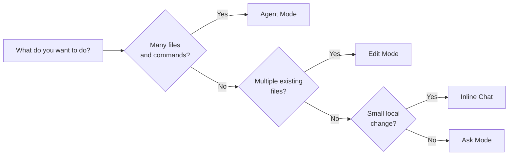
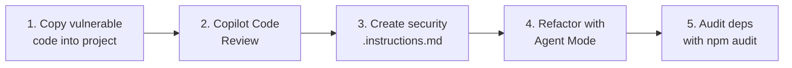

<div align="center">

  # 🚀 Copilot for NestJS: From Prompt to Secure Code

  ### Hands-on GitHub Copilot workshop for NestJS developers

  [](https://github.com/features/copilot)
  [](https://nestjs.com/)
  [](https://www.typescriptlang.org/)
  [](https://jestjs.io/)
  [](https://owasp.org/Top10/)

  [🇪🇸 Español (LATAM)](./README.md) · 🇺🇸 **English (US)**

</div>

---

**This hands-on training** teaches you how to leverage **GitHub Copilot** across a real **NestJS** development flow: from the different interaction surfaces (completions, NES, Inline Chat, Chat with Ask/Edit/Agent modes, Copilot CLI, and Code Review), through techniques to **improve response quality** with context and custom instructions, all the way to **code generation**, **unit test creation**, and **detecting and mitigating** security vulnerabilities.

> 📚 Official documentation for the tools used in this workshop:
>
> - [GitHub Copilot Chat](https://docs.github.com/en/copilot/how-tos/use-copilot-chat)
> - [Custom instructions & prompt files](https://docs.github.com/en/copilot/customizing-copilot)
> - [NestJS Documentation](https://docs.nestjs.com/)
> - [Jest Testing Framework](https://jestjs.io/docs/getting-started)
> - [OWASP Top 10 (2021)](https://owasp.org/Top10/)
> - [Copilot Code Review](https://docs.github.com/en/copilot/using-github-copilot/code-review)

---

## 📋 Table of Contents

1. [🚀 Set up the lab](#-set-up-the-lab)
2. [🎛️ Step 1. GitHub Copilot Interaction Methods](#️-step-1-github-copilot-interaction-methods)
3. [🧭 Step 2. Improve Interactions with Context and Personalization](#-step-2-improve-interactions-with-context-and-personalization)
4. [🛠️ Step 3. Code Generation and Refactoring](#️-step-3-code-generation-and-refactoring)
   - [3.1 Create the `products` module (Agent Mode)](#31-create-the-products-module-agent-mode)
   - [3.2 Add a cross-file field (Edit Mode)](#32-add-a-cross-file-field-edit-mode)
   - [3.3 Local refactor (Inline Chat)](#33-local-refactor-inline-chat)
   - [3.4 Translate external code (optional)](#34-translate-external-code-optional)
5. [🧪 Step 4. Unit Testing with Jest](#-step-4-unit-testing-with-jest)
6. [🛡️ Step 5. Detect and Mitigate Vulnerabilities](#️-step-5-detect-and-mitigate-vulnerabilities)

---

## ⏱️ Estimated duration

| Block                                                          | Time        |
| -------------------------------------------------------------- | ----------- |
| 🚀 Lab setup                                                   | 5 min       |
| 🎛️ Step 1 — Interaction Methods                                | 10 min      |
| 🧭 Step 2 — Improve Interactions                               | 10 min      |
| 🛠️ Step 3 — Code Generation and Refactoring                    | 15 min      |
| 🧪 Step 4 — Unit Testing                                       | 10 min      |
| 🛡️ Step 5 — Detect and Mitigate Vulnerabilities                | 10 min      |
| **Total**                                                      | **~60 min** |

---

## 🎯 Learning objectives

By the end of this workshop you will be able to:

- ✅ Identify and use every Copilot **interaction surface** (completions, NES, Inline Chat, Ask/Edit/Agent, Copilot CLI, Code Review) and know which one to pick for each task.
- ✅ Elevate response quality using **context variables** (`#codebase`, `#file`, `#problems`, `#terminalLastCommand`…), **model selection**, **custom instructions** (`.github/copilot-instructions.md`, `*.instructions.md` with `applyTo`), **prompt files** (`*.prompt.md`), and custom **chat modes**.
- ✅ Build a full NestJS module (entity, DTOs, service, controller, module) with **Agent Mode**, extend it with **Edit Mode**, and polish it with **Inline Chat**.
- ✅ Generate unit tests with Jest and `@nestjs/testing` using `/tests`, and **fix failing tests** with Agent Mode + `#terminalLastCommand` + `#problems`.
- ✅ Detect common **OWASP Top 10** vulnerabilities with **Copilot Code Review** and apply concrete mitigations guided by reusable security instructions.

---

## 📚 Prerequisites

Before you start, make sure you have:

- [Visual Studio Code](https://code.visualstudio.com/) (latest stable release).
- **GitHub Copilot** and **GitHub Copilot Chat** extensions installed and enabled.
- An **active GitHub Copilot subscription** (Free, Pro, Business, or Enterprise).
- [Node.js 20 LTS or newer](https://nodejs.org/) (22 LTS recommended).
- [Git](https://git-scm.com/downloads).
- [GitHub CLI](https://cli.github.com/) with the **Copilot CLI** extension:

  ```bash
  gh extension install github/gh-copilot
  ```

- (Optional) [Docker Desktop](https://www.docker.com/products/docker-desktop/) if you want to persist data in Postgres for advanced exercises.

Verify your installation:

```bash
node --version
npm --version
git --version
code --version
gh copilot --version
```

---

## 🚀 Set up the lab

### 1. Clone the repo and switch to the workshop branch

```bash
git clone https://github.com/CleveritDemo/copilot-nestjs
cd copilot-nestjs
git checkout updated-main
```

### 2. Install dependencies

```bash
npm install
```

### 3. Open in VS Code

```bash
code .
```

### 4. Validate that Copilot responds

Open the Chat view (`Ctrl+Alt+I` on Windows/Linux · `Cmd+Ctrl+I` on macOS) and try:

```text
Hi Copilot, list the npm scripts available in this project using #codebase.
```

If you get a response, you're ready. If not, sign in from the Command Palette with **GitHub: Sign in**.

### 5. (Optional) Start Postgres

Only if you're going to run the exercises that require a real database:

```bash
docker run --name postgres-workshop `
  -e POSTGRES_PASSWORD=workshop `
  -e POSTGRES_DB=copilot-nestjs `
  -p 5432:5432 -d postgres:16
```

> [!NOTE]
> The block above uses PowerShell line continuation (backtick `` ` ``). On bash/zsh, replace backticks with `\`.

### 6. Get familiar with the model picker

At the bottom of the chat input box you'll find the **model picker**. Confirm you can choose among the models your plan offers (for example Claude Sonnet, GPT-5, or reasoners). We'll swap models throughout the workshop.

> [!TIP]
> For large generation or complex refactor tasks, pick a large model. For completions and small edits, a fast model performs better.

---

## 🎛️ Step 1. GitHub Copilot Interaction Methods

**Goal:** know every Copilot interaction surface and when to use each one.

### 1.1 Big picture

GitHub Copilot is no longer just autocomplete. It exposes multiple surfaces, each optimized for a different context:

| Surface                              | Shortcut / Location                                        | When to use it                                                                    |
| ------------------------------------ | ---------------------------------------------------------- | --------------------------------------------------------------------------------- |
| **Code Completions** (ghost text)    | Automatic suggestion while typing; `Tab` to accept         | You're writing code and want to autocomplete lines or blocks.                     |
| **Next Edit Suggestions (NES)**      | Appears after an edit; `Tab` to jump/accept                | Copilot predicts the next related edit.                                           |
| **Inline Chat**                      | `Ctrl+I` / `Cmd+I` on the selection or cursor              | Modify specific code without leaving the editor.                                  |
| **Chat View — Ask mode**             | Chat View, *Ask* selector                                  | Conceptual questions, exploration, *"how does this work?"*.                       |
| **Chat View — Edit mode**            | Chat View, *Edit* selector                                 | Edit multiple files at once with preview before applying.                         |
| **Chat View — Agent mode**           | Chat View, *Agent* selector                                | Multi-step tasks where Copilot reads, edits, runs commands, and runs tests.       |
| **Quick Chat**                       | `Ctrl+Shift+I` / `Cmd+Shift+I`                             | Quick question without opening the full panel.                                    |
| **Smart Actions** (context menu)     | Right-click → *Copilot*                                    | Actions: *Explain*, *Fix*, *Review*, *Generate Docs*, *Generate Tests*.           |
| **Copilot CLI**                      | Terminal: `gh copilot suggest` / `explain`                 | Suggest and explain shell commands.                                               |
| **Copilot Code Review**              | *Review* button in chat or on a PR                         | Assisted review of a diff before committing/merging.                              |

> [!IMPORTANT]
> The standalone "Copilot Edits" panel from previous versions **no longer exists**. Edit is now a **mode** inside the Chat View, together with Ask and Agent.

### 1.2 Try 4 surfaces in order

#### 1️⃣ Code Completions

Open [`src/app.service.ts`](./src/app.service.ts) and below `getHello()` start typing:

```typescript
getGreeting(name: string):
```

Wait ~1 second. Copilot will complete the signature and body. Press `Tab` to accept.

#### 2️⃣ Next Edit Suggestions (NES)

In the same file, change `getHello()` so it returns `'Hello World in English!'`. Copilot will detect that you probably want to update the related test in [`src/app.controller.spec.ts`](./src/app.controller.spec.ts) and offer to jump there. `Tab` to navigate, `Tab` to accept.

#### 3️⃣ Inline Chat

Select the `getHello()` method and press `Ctrl+I` (`Cmd+I` on macOS). Type:

```text
Add an optional `locale` parameter that returns the greeting in Spanish or English based on the value.
```

Review the inline diff and accept with `Enter` or discard with `Esc`.

#### 4️⃣ Chat View — Ask mode

Open Chat View (`Ctrl+Alt+I`), select **Ask** in the mode picker, and type:

```text
#codebase Explain the structure of this NestJS project and what each file inside src/ does.
```

### 1.3 Copilot in the CLI

From an integrated terminal, try:

```bash
gh copilot suggest "start a postgres 16 container with a persistent volume and a copilot-nestjs database"
```

```bash
gh copilot explain "docker run --name pg -e POSTGRES_PASSWORD=xyz -p 5432:5432 -d postgres:16"
```

> [!TIP]
> Copilot CLI lets you **execute**, **copy**, or **revise** the suggested command before running it.

### 1.4 Copilot Code Review (intro)

Next to the send button in Chat View there's a **Review** action. You can also:

- Select code in the editor → right-click → *Copilot → Review and comment*.
- Ask for a review of the current diff with `#changes`.

We'll dive deeper in [Step 5 — Security](#️-step-5-detect-and-mitigate-vulnerabilities).

### ✅ Step 1 checkpoint

- [ ] Accepted at least one code completion.
- [ ] Used Inline Chat to modify a method.
- [ ] Ran a prompt in Chat View — Ask mode with `#codebase`.
- [ ] Ran `gh copilot suggest` from the terminal.

---

## 🧭 Step 2. Improve Interactions with Context and Personalization

**Goal:** get more accurate, consistent responses using context variables, custom instructions, prompt files, chat modes, and model selection.

### 2.1 Context variables (`#…`)

`#` variables inject typed context into your prompt. Much more precise than describing context in words.

| Variable                  | What it injects                                                                |
| ------------------------- | ------------------------------------------------------------------------------ |
| `#codebase`               | Semantic index of the whole workspace (replaces `@workspace`).                 |
| `#file`                   | Contents of a specific file.                                                   |
| `#folder`                 | All files in a folder.                                                         |
| `#selection`              | Current editor selection.                                                      |
| `#problems`               | All workspace diagnostics (errors/warnings).                                   |
| `#terminalLastCommand`    | Last terminal command and its output.                                          |
| `#terminalSelection`      | Current selection in the terminal panel.                                       |
| `#changes`                | Diff of current Git changes (staged + unstaged).                               |
| `#usage`                  | References/definitions of a symbol.                                            |
| `#fetch`                  | Contents of a public URL.                                                      |
| `#githubRepo`             | Information about a remote GitHub repository.                                  |

**Quick exercise:** in Ask mode, run this prompt **with** and **without** `#codebase` and compare:

```text
Based on #codebase, what version of NestJS are we using and which npm scripts are available?
```

### 2.2 Attach files, folders, and images

With the **📎 Add Context** icon (or `Ctrl+/`) you can attach files, folders, symbols, images (screenshot, mockup, diagram), and the active editor window.

> [!TIP]
> Attaching images works with vision-capable models. Ideal for *"generate the HTML/CSS for this mockup"*.

### 2.3 Model selection

Use the **model picker** at the bottom of the chat input:

- **Claude Sonnet / Opus** — long reasoning, complex refactors, explanations.
- **GPT-5 / GPT-4.1** — balanced for generation, editing, and agent work.
- **o-series** (reasoners) — tasks with many logical dependencies.
- **Fast models** — quick completions, small edits.

### 2.4 Custom Instructions

Copilot automatically reads instructions from special files in the repo. **Avoids repeating the same prompt** over and over.

#### 2.4.1 Repo-wide instructions

[`.github/copilot-instructions.md`](./.github/copilot-instructions.md) already exists. Open it and review — Copilot applies it to **every prompt** in the workspace.

#### 2.4.2 Pattern-scoped instructions (`.instructions.md`)

You can create more granular rules that only activate for certain files. Create `.github/instructions/typescript.instructions.md`:

```markdown
---
applyTo: "**/*.ts"
---

- Always use explicit types on parameters and return values of exported functions.
- Prefer `readonly` on immutable class properties.
- Avoid `enum`; use `as const` with union types.
- All imports must use the `src/` alias when it exists.
```

Copilot will load these rules **only when working with `.ts` files**.

> [!NOTE]
> The `applyTo` frontmatter accepts glob patterns. You can have multiple `.instructions.md` files for different layers (e.g. `**/*.spec.ts`, `src/products/**`, etc.).

**Quick exercise:** after creating the file, in Ask mode ask:

```text
#codebase Suggest a refactor for AppService that respects our conventions.
```

Notice how the response now **respects** the rules from `.instructions.md`.

### 2.5 Prompt Files (`.prompt.md`)

Prompt files are reusable templates. They live in [`.github/prompts/`](./.github/prompts/) and show up as slash commands in the chat.

This repo already ships three prompt files ready to use:

| Prompt file                                                                        | Mode  | Purpose                                                             |
| ---------------------------------------------------------------------------------- | ----- | ------------------------------------------------------------------- |
| [`generar-crud-nestjs.prompt.md`](./.github/prompts/generar-crud-nestjs.prompt.md) | Agent | Scaffold a complete NestJS module with a parameterized name.        |
| [`revisar-seguridad.prompt.md`](./.github/prompts/revisar-seguridad.prompt.md)     | Ask   | OWASP Top 10 audit over the attached code.                          |
| [`generar-tests.prompt.md`](./.github/prompts/generar-tests.prompt.md)             | Edit  | Generate specs with Jest + `@nestjs/testing`.                       |

**How to invoke:** in the chat type `/generar-crud-nestjs` (or the prompt name) and it appears in the picker with its parameters.

### 2.6 Custom Chat Modes (`.chatmode.md`)

You can create **custom chat modes** with a system prompt and a restricted tool set. Useful for *"security reviewer mode"*, *"mentor mode"*, *"DBA mode"*, etc.

Syntax example (do not create it now, just for reference) in `.github/chatmodes/security-reviewer.chatmode.md`:

```markdown
---
description: Security reviewer focused on OWASP Top 10.
tools: ['codebase', 'search', 'problems']
model: Claude Sonnet
---

You are a security expert. Review code strictly through the OWASP Top 10 lens.
For each issue:
1. Describe the risk.
2. Show a vulnerable snippet.
3. Propose a mitigation with concrete code.
```

### 2.7 MCP (Model Context Protocol) — quick mention

**MCP servers** let you connect Copilot to **external sources** (databases, Jira, Confluence, your own API…) via `.vscode/mcp.json`. Out of scope for this 1-hour workshop, but keep it in mind.

### ✅ Step 2 checkpoint

- [ ] Used at least 3 different `#…` variables in a prompt.
- [ ] Switched the active model from the picker.
- [ ] Created `.github/instructions/typescript.instructions.md`.
- [ ] Invoked at least one prompt file as a slash command.

---

## 🛠️ Step 3. Code Generation and Refactoring

**Goal:** build a full NestJS module with **Agent Mode**, extend it with **Edit Mode**, and polish it with **Inline Chat**.

### Decision map



### 3.1 Create the `products` module (Agent Mode)

In Chat View, select **Agent** in the mode picker and send:

```text
#codebase Create a NestJS `products` module with this structure:

- `src/products/entities/product.entity.ts`: TypeORM entity with id (uuid v4), name, description, image, price, quantity, isAvailable, category.
- `src/products/dto/create-product.dto.ts`: DTO with class-validator validations.
- `src/products/dto/update-product.dto.ts`: extends CreateProductDto using `PartialType` from `@nestjs/mapped-types`.
- `src/products/products.service.ts`: full CRUD with TypeORM Repository. `findOne` must throw `NotFoundException`.
- `src/products/products.controller.ts`: standard REST endpoints.
- `src/products/products.module.ts`: registers TypeOrmModule.forFeature([Product]).

Then:
1. Update `src/app.module.ts` to import `ProductsModule` and configure `TypeOrmModule.forRoot` reading from `@nestjs/config` (host, port, username, password, database from .env).
2. Create a `.env.example` with the variables.
3. Install the required dependencies (`@nestjs/typeorm`, `typeorm`, `pg`, `class-validator`, `class-transformer`, `@nestjs/config`, `@nestjs/mapped-types`, `uuid`).
4. Run `npm run build` to verify it compiles.

Respect the rules from #codebase (no `any`, use uuid v4, etc.).
```

Agent Mode will show you **every action** (running commands, creating files, editing existing files) and ask for approval on any that touches your system. Approve what you want to apply.

> [!TIP]
> You can **stop** the agent with the *Stop* button or **pause** it to inspect a change before it continues.

Verification:

```bash
npm run build
```

If it compiles, the module is ready.

### 3.2 Add a cross-file field (Edit Mode)

Let's add a `sku` field, propagating it across several files.

1. In Chat View, switch to **Edit** mode.
2. Attach with 📎 (or drag from the explorer):
   - `src/products/entities/product.entity.ts`
   - `src/products/dto/create-product.dto.ts`
   - `src/products/products.service.ts`
   - `src/products/products.controller.ts`
3. Send:

```text
Add a required, unique `sku: string` field to Product:

- In the entity, mark it with `@Column({ unique: true })`.
- In the CreateProductDto, validate with `@IsString()` and `@Length(3, 32)`.
- In the service, in `create()`, if the sku already exists, throw `ConflictException` from `@nestjs/common`.
- Update the controller if needed.

Do not modify anything else.
```

Edit Mode shows a **diff per file** you can accept or reject individually.

### 3.3 Local refactor (Inline Chat)

Open `src/products/products.service.ts`, select the `findOne` method, and press `Ctrl+I`:

```text
Refactor to return the product with only `id`, `name`, and `price`, using `Pick<Product, ...>` as the return type.
```

Review the inline diff and accept with `Enter`.

### 3.4 Translate external code (optional)

You can ask Copilot to translate code from another language. For example, attaching an Azure OpenAI Python snippet:

In Edit mode, attach `src/products/products.service.ts` and paste the following snippet as context:

```python
import requests

headers = {'api-key': 'YOUR_API_KEY', 'Content-Type': 'application/json'}
params = {'api-version': '2024-02-15-preview'}
json_data = {
    'messages': [
        {'role': 'system', 'content': 'You are an ai wizard that helps people create product descriptions.'},
        {'role': 'user', 'content': 'nike'},
    ],
    'max_tokens': 800,
    'temperature': 0.7,
}
response = requests.post(
    'https://YOUR-RESOURCE.openai.azure.com/openai/deployments/YOUR-DEPLOYMENT/chat/completions',
    params=params, headers=headers, json=json_data,
)
```

And this prompt:

```text
Translate this Python call to a NestJS `OpenAIService` in `src/products/openai.service.ts` using `@nestjs/axios`.
Add `OpenAIService` as a dependency of `ProductsService` and inject it in `findOne` to enrich the product description.
Do not hardcode the API key: use `ConfigService` to read it from `OPENAI_API_KEY`.
```

> [!IMPORTANT]
> Copilot **should not** hardcode the key. If it does, it's a perfect segue into [Step 5 — Security](#️-step-5-detect-and-mitigate-vulnerabilities).

### ✅ Step 3 checkpoint

- [ ] `products` module functional (compiles with `npm run build`).
- [ ] `sku` field propagated to entity, DTO, and service.
- [ ] Refactor applied with Inline Chat.

---

## 🧪 Step 4. Unit Testing with Jest

**Goal:** generate unit tests with Jest and `@nestjs/testing`, and use Agent Mode to fix failing tests.

> [!NOTE]
> Prerequisite: complete [Step 3](#️-step-3-code-generation-and-refactoring) — we need `ProductsService`.

### 4.1 Generate tests with `/tests`

1. Open `src/products/products.service.ts` and **select the `findAll` method**.
2. In Chat View (Ask or Edit) type:

```text
/tests Generate unit tests with Jest and @nestjs/testing for the selected method. Mock the TypeORM Repository with `getRepositoryToken`.
```

Copilot will propose the contents of `src/products/products.service.spec.ts`:

```typescript
import { Test, TestingModule } from '@nestjs/testing';
import { getRepositoryToken } from '@nestjs/typeorm';
import { Repository } from 'typeorm';
import { ProductsService } from './products.service';
import { Product } from './entities/product.entity';

describe('ProductsService', () => {
  let service: ProductsService;
  let repository: Repository<Product>;

  beforeEach(async () => {
    const module: TestingModule = await Test.createTestingModule({
      providers: [
        ProductsService,
        {
          provide: getRepositoryToken(Product),
          useClass: Repository,
        },
      ],
    }).compile();

    service = module.get<ProductsService>(ProductsService);
    repository = module.get<Repository<Product>>(getRepositoryToken(Product));

    jest.clearAllMocks();
  });

  describe('findAll', () => {
    it('returns an array of products', async () => {
      const products: Product[] = [/* ... */];
      jest.spyOn(repository, 'find').mockResolvedValue(products);
      expect(await service.findAll()).toBe(products);
    });
  });
});
```

### 4.2 Run the tests

```bash
npm test
```

If a test fails, **don't fix it by hand**: jump to the next step.

### 4.3 Fix tests with Agent Mode

When a test fails, the terminal output is available via `#terminalLastCommand`. In **Agent** mode:

```text
The tests in `products.service.spec.ts` are failing. Use #terminalLastCommand to diagnose and #problems for compiler errors. Fix the tests (do not touch the service logic unless it's an obvious bug) and re-run `npm test` until they all pass.
```

Agent Mode will:

1. Read the failure.
2. Edit the spec.
3. Re-run `npm test`.
4. Iterate until green (or until it asks for help).

> [!TIP]
> If the agent loops, stop it with **Stop** and ask for a more specific analysis using `#file:products.service.spec.ts`.

### 4.4 Complete the coverage

In Edit mode, with `src/products/products.service.ts` and `src/products/products.service.spec.ts` attached:

```text
Complete the spec to cover every method of ProductsService (findOne, create, update, remove).

Include:
- Happy path for each method.
- `findOne` when the product does NOT exist (must throw `NotFoundException`).
- `create` when the sku already exists (must throw `ConflictException`).
- `update` when the id does not exist.
- `remove` when the id does not exist.

Follow the style of the current spec and respect the rules from #codebase.
```

Verify:

```bash
npm run test:cov
```

With this flow you should land near **100% coverage** on the service.

### 4.5 Bonus — Tests for the Controller

Same approach: attach `src/products/products.controller.ts` and ask:

```text
Generate `src/products/products.controller.spec.ts` mocking `ProductsService` with `jest.fn()`.
Cover every endpoint and verify that exceptions from the service propagate.
```

### ✅ Step 4 checkpoint

- [ ] `products.service.spec.ts` with every method covered and passing.
- [ ] (Bonus) `products.controller.spec.ts` passing.
- [ ] Practiced fixing a failing test with Agent Mode + `#terminalLastCommand`.

---

## 🛡️ Step 5. Detect and Mitigate Vulnerabilities

**Goal:** use Copilot to spot common **OWASP Top 10** issues and apply concrete mitigations.

### 5.1 Exercise overview

We'll work with an **intentionally vulnerable** file: [`assets/vulnerable-code-example.md`](./assets/vulnerable-code-example.md). It ships with at least 7 OWASP categories: hardcoded credentials, SQL injection, `eval()` over user input, insecure authentication, sensitive-data logging, open CORS, unsafe deserialization, and broken access control.



### 5.2 Copy the snippet into the project

Open [`assets/vulnerable-code-example.md`](./assets/vulnerable-code-example.md), copy the TypeScript block, and paste it into `src/vulnerable.controller.ts`. (You can ask the agent to create it for you.)

### 5.3 Exercise A — Copilot Code Review

With the file open in the editor:

1. Select all (`Ctrl+A`).
2. Right-click → **Copilot → Review and comment**.

Copilot generates **inline comments** with severity and suggested fixes. Review them.

**Alternative from chat (Ask mode):**

```text
#file:src/vulnerable.controller.ts Review this file through the OWASP Top 10 (2021) lens. For each finding return:

1. OWASP category.
2. Severity (Critical / High / Medium / Low).
3. Vulnerable code excerpt.
4. Potential impact.
5. Concrete NestJS mitigation code.

Return the result as a Markdown table.
```

> [!TIP]
> You can also invoke the prompt file [`revisar-seguridad.prompt.md`](./.github/prompts/revisar-seguridad.prompt.md) with `/revisar-seguridad` and attach the file.

### 5.4 Exercise B — Security custom instructions

Create `.github/instructions/security.instructions.md`:

```markdown
---
applyTo: "src/**/*.ts"
---

Non-negotiable security requirements for this project:

- Never hardcode secrets, tokens, API keys, or passwords. Use `@nestjs/config` and `.env`.
- All endpoint inputs MUST be validated with `class-validator` and enforced by a global `ValidationPipe`.
- Never concatenate strings to build SQL queries. Use TypeORM's QueryBuilder or bound parameters.
- Never use `eval`, `Function()`, or `child_process.exec` with user input.
- Passwords: hash with `argon2` or `bcrypt` (cost ≥ 12) and compare with the library's `verify`/`compare` function (constant time).
- Logs: never log tokens, passwords, PII, or full request bodies.
- CORS: never `origin: '*'` in production. Read allowlist from config.
- Headers: use `helmet` in `main.ts`.
- Rate limiting: use `@nestjs/throttler` on public endpoints.
```

Copilot will apply these rules from now on **in any prompt involving files under `src/`**.

### 5.5 Exercise C — Apply mitigations with Agent Mode

In **Agent** mode:

```text
Refactor `src/vulnerable.controller.ts` strictly following the rules in #file:.github/instructions/security.instructions.md and OWASP Top 10.

For each change briefly explain which vulnerability it mitigates.

When done:
1. Install the required dependencies (`helmet`, `@nestjs/throttler`, `argon2`, or others if applicable).
2. Update `main.ts` to apply `helmet` and a global `ValidationPipe`.
3. Run `npm run build` to verify.
```

Approve changes one by one, reviewing what each action does.

### 5.6 Exercise D — Detect vulnerable dependencies

In the terminal:

```bash
npm audit
```

If there are findings, in **Agent** mode:

```text
Analyze the output of #terminalLastCommand. For every High/Critical vulnerable dependency, propose an action (upgrade, replace, patch). Apply the lowest-risk changes in `package.json` and run `npm install` + `npm run build` to validate.
```

### 5.7 Copilot Autofix (GitHub Advanced Security)

When this project is pushed to GitHub with **GitHub Advanced Security** enabled, every **CodeQL** or **Secret Scanning** alert may get a **Copilot Autofix** suggesting the PR automatically. It's the server-side counterpart of what you just did locally.

### 5.8 Best practices when using Copilot for security

> [!IMPORTANT]
> **Never trust the output 100%.** Copilot can introduce vulnerable code if the prompt implicitly asks for it. Always review.

1. **Reinforce with `.instructions.md`** the hard rules (secrets, SQLi, XSS, deserialization).
2. **Use Copilot Code Review** on every PR as a baseline, not as a substitute for SAST/DAST.
3. **Prefer standard mitigations** (helmet, class-validator, throttler, argon2) over ad-hoc solutions.
4. **Prompt injection in tool outputs:** when Copilot reads `#fetch` or external MCP tools, that content may try to manipulate the model. Always treat tool output as *untrusted input*.

### ✅ Step 5 checkpoint

- [ ] Ran Copilot Code Review on the vulnerable file.
- [ ] Created `.github/instructions/security.instructions.md`.
- [ ] Refactored the vulnerable file with Agent Mode.
- [ ] Ran `npm audit` and interpreted the result with Copilot.

---

## 🧹 Cleanup

Stop the Postgres container (if you started one):

```bash
docker stop postgres-workshop; docker rm postgres-workshop
```

Return to the initial branch state:

```bash
git restore .
git clean -fd
```

> [!WARNING]
> `git clean -fd` removes **untracked** files and folders. If you want to keep the files you generated during the workshop, skip this command.

---

## 📁 Repository structure

```text
copilot-nestjs/
├── README.md                                  # 🇪🇸 Spanish (LATAM) version
├── README_EN.md                               # 🇺🇸 This workshop (English)
├── package.json                               # NestJS + Jest dependencies
├── tsconfig.json / tsconfig.build.json
├── nest-cli.json
├── eslint.config.mjs / .prettierrc
├── src/                                       # NestJS base code
│   ├── app.controller.ts / .spec.ts
│   ├── app.module.ts
│   ├── app.service.ts
│   └── main.ts
├── test/                                      # e2e tests
│   ├── app.e2e-spec.ts
│   └── jest-e2e.json
├── assets/                                    # Workshop resources
│   └── vulnerable-code-example.md             # OWASP snippet for Step 5
└── .github/
    ├── copilot-instructions.md                # Repo-wide instructions
    └── prompts/                               # Reusable prompt files
        ├── generar-crud-nestjs.prompt.md
        ├── generar-tests.prompt.md
        └── revisar-seguridad.prompt.md
```

---

## 🧠 Key takeaways

1. **Pick the right mode:** Ask to inquire, Edit for multiple files with preview, Agent for multi-step tasks that need commands and verification.
2. **Context beats long prompts:** `#codebase`, `#file`, `#problems`, `#terminalLastCommand` replace entire paragraphs of description.
3. **Custom instructions scale:** instead of repeating "no `any`" on every prompt, write it once in `.github/copilot-instructions.md`.
4. **Reusable prompt files:** turn your best prompts into `.prompt.md` so the whole team uses them as slash commands.
5. **Copilot does not replace your security judgment:** you define the policy, Copilot writes the code for that policy. Always review — especially anything auth, crypto, and input validation.
6. **The loop matters:** with Agent Mode the best pattern is *"change → run build/tests → if it fails, fix"*. Copilot iterates only if you give it the output context.

---

<div align="center">

  **🎉 You reached the end of the workshop!**

  If you want to keep practicing, ask Copilot to add an `orders` module that depends on `products`, or to integrate JWT auth respecting the security rules we already defined.

</div>

---

## 📜 License

Distributed under the MIT License. See [LICENSE](./LICENSE) if present in the repo.
