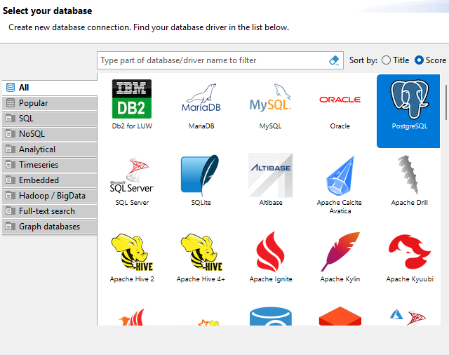
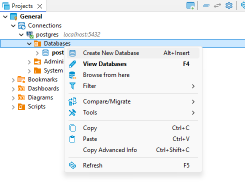
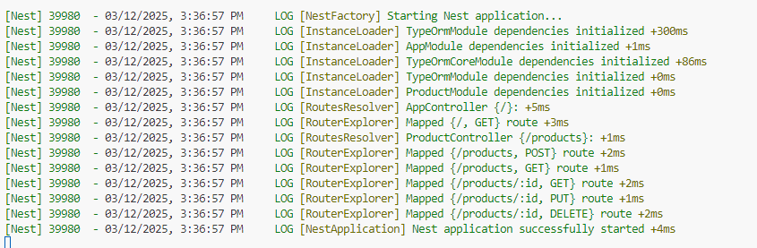
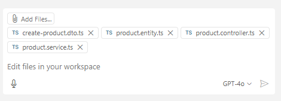

# Desarrollando soluciones avanzadas con Nest, Jest y Postgres (TypeORM) usando GitHub Copilot.

## 💫 Descripción General

En este proyecto práctico, desarrollaremos una aplicación NestJS integrada con una base de datos PostgreSQL utilizando TypeORM. El proyecto cubrirá la configuración de NestJS con un archivo .env, el establecimiento de una conexión con la base de datos PostgreSQL y la implementación de operaciones CRUD. Además, mejoraremos el proyecto con documentación Swagger, utilizaremos Azure Open AI para mejores descripciones de productos y crearemos pruebas unitarias completas utilizando Jest.

## 🎯️ Objetivos

- Usar GitHub Copilot en la CLI para crear un contenedor de PostgreSQL.
- Configurar Nest Config usando un archivo .env.
- Conectar a la base de datos Postgres usando TypeORM.
- Crear un archivo Seeder para poblar la base de datos.
- Crear métodos de actualización y eliminación.
- Crear una mejor descripción de los productos usando Azure Open AI.
- Añadir documentación Swagger.
- Crear un archivo README.md con la documentación del desarrollador del proyecto.
- Exportar Chat a la documentación del desarrollador.
- Crear pruebas unitarias para los servicios.

## 🛠️ Requisitos de instalación

- VS Code
- Docker para Desktop
- Node instalado (nvm opcional)
- GitHub CLI + Extensión de GitHub Copilot habilitada
- Insomnia o Postman o cualquier cliente REST instalado
- DBeaver o cualquier cliente de base de datos instalado

## ℹ️ Instrucciones de Copilot

En esta actividad, utilizaremos instrucciones de Copilot para personalizar y mejorar las respuestas del chat proporcionando información contextual a través de un archivo del repositorio, mejorando la calidad y relevancia de la asistencia de Copilot.

```
Para este proyecto de Nest JS, utilizaremos @nestjs/typeorm para la persistencia y Postgres como la base de datos, así que ten esto en cuenta al responder las preguntas.

También utilizaremos el módulo @nestjs/swagger para generar la documentación de la API.

Usaremos class-validator y class-transformer para validar y transformar los datos.

Usaremos '@nestjs/testing' para las pruebas. Genera pruebas para los servicios y controladores cuando se te pida escribir pruebas utilizando el framework jest.

No uses any para definir los tipos de las variables.

Usa versiones de dependencias que sean compatibles con la versión actual de este proyecto de Nest JS.

Usa módulos para organizar el código y separar las responsabilidades.

Usa uuid para generar los IDs y usa el estándar de la versión 4 de uuid.
```

## Antes de Empezar

1. **Clona el Repositorio**

	 ```bash
	 git clone https://github.com/CleveritDemo/copilot-nestjs
	 ```

2. **Navega al directorio del proyecto**

	 ```bash
	 cd copilot-nestjs
	 ```

3. **Instala Dependencias**

	 ```bash
	 npm install
	 ```

## 🖥️ Paso a Paso

### 1. Crear Módulo de Productos

👤 Indicación:

```bash
@workspace Cómo crear una entidad llamada productos, esta entidad tiene 4 atributos: id: string, nombre: string, descripción: string, imagen: string. También genera el servicio con operaciones CRUD básicas y los DTOs necesarios.
```

🤖 Respuesta:

Copilot should respond with the following code:

**Instala las dependencias Necesarias**:

```bash
npm install @nestjs/typeorm typeorm pg class-validator class-transformer uuid
```

**Crear la entidad Producto**: Crea un archivo product.entity.ts en el directorio src/products/entities.

```typescript
import { Entity, Column, PrimaryGeneratedColumn } from 'typeorm';

@Entity()
export class Product {
	@PrimaryGeneratedColumn('uuid')
	id: string;

	@Column()
	name: string;

	@Column()
	description: string;

	@Column()
	image: string;
}
```

**Crear los DTOs de Producto**:

Crea un archivo `create-product.dto.ts` en el directorio src/products/dto.

```typescript
import { IsString } from 'class-validator';

export class CreateProductDto {
	@IsString()
	name: string;

	@IsString()
	description: string;

	@IsString()
	image: string;
}
```

Crea un archivo `update-product.dto.ts` en el directorio src/products/dto.

```typescript
import { CreateProductDto } from './create-product.dto';

export class UpdateProductDto extends CreateProductDto {}
```

#### ⚠️ Solución de problemas

Si encuentras este error: Cannot find module '@nestjs/mapped-types' or its corresponding type declarations. en el archivo `update-product.dto.ts`, puedes solucionarlo pidiendo a Copilot que proporcione una solución usando el comando fix using copilot o eliminando la declaración de importación.

**Solución**:

**Instala @nestjs/swagger** o **elimina la declaración de importación** del archivo `update-product.dto.ts`.

```typescript
import { CreateProductDto } from './create-product.dto';
export class UpdateProductDto extends CreateProductDto {}
```

**Crea un archivo `product.service.ts`** en el directorio src/products.

```typescript
import { Injectable } from '@nestjs/common';
import { InjectRepository } from '@nestjs/typeorm';
import { Repository } from 'typeorm';
import { Product } from './entities/product.entity';
import { CreateProductDto } from './dto/create-product.dto';
import { UpdateProductDto } from './dto/update-product.dto';

@Injectable()
export class ProductService {
	constructor(
		@InjectRepository(Product)
		private productRepository: Repository<Product>,
	) {}

	create(createProductDto: CreateProductDto): Promise<Product> {
		const product = this.productRepository.create(createProductDto);
		return this.productRepository.save(product);
	}

	findAll(): Promise<Product[]> {
		return this.productRepository.find();
	}

	findOne(id: string): Promise<Product> {
		return this.productRepository.findOneBy({ id });
	}

	async update(
		id: string,
		updateProductDto: UpdateProductDto,
	): Promise<Product> {
		await this.productRepository.update(id, updateProductDto);
		return this.productRepository.findOneBy({ id });
	}

	async remove(id: string): Promise<void> {
		await this.productRepository.delete(id);
	}
}
```

#### ⚠️ Solución de problemas

Si encuentras este error: Type 'Product | null' is not assignable to type 'Product'. Type 'null' is not assignable to type 'Product'. en el archivo `product.service.ts`, puedes solucionarlo pidiendo a Copilot que proporcione una solución usando el comando `fix using copilot`.

**Solución**:

```typescript
	async findOne(id: string): Promise<Product> {
		const product = await this.productRepository.findOneBy({ id });
		if (!product) {
			throw new NotFoundException(`Product with ID ${id} not found`);
		}
		return product;
	}
```

Asegúrate de importar NotFoundException de `@nestjs/common`

**Crea el archivo `product.controller.ts`** en el directorio src/products.

```typescript
import {
	Controller,
	Get,
	Post,
	Body,
	Param,
	Delete,
	Put,
} from '@nestjs/common';
import { ProductService } from './product.service';
import { CreateProductDto } from './create-product.dto';
import { UpdateProductDto } from './update-product.dto';
import { Product } from './product.entity';

@Controller('products')
export class ProductController {
	constructor(private readonly productService: ProductService) {}

	@Post()
	create(@Body() createProductDto: CreateProductDto): Promise<Product> {
		return this.productService.create(createProductDto);
	}

	@Get()
	findAll(): Promise<Product[]> {
		return this.productService.findAll();
	}

	@Get(':id')
	findOne(@Param('id') id: string): Promise<Product> {
		return this.productService.findOne(id);
	}

	@Put(':id')
	update(
		@Param('id') id: string,
		@Body() updateProductDto: UpdateProductDto,
	): Promise<Product> {
		return this.productService.update(id, updateProductDto);
	}

	@Delete(':id')
	remove(@Param('id') id: string): Promise<void> {
		return this.productService.remove(id);
	}
}
```

**Crear el módulo Producto**: Crea un archivo `product.module.ts` en el directorio src/products.

```typescript
import { Module } from '@nestjs/common';
import { TypeOrmModule } from '@nestjs/typeorm';
import { ProductService } from './product.service';
import { ProductController } from './product.controller';
import { Product } from './product.entity';

@Module({
	imports: [TypeOrmModule.forFeature([Product])],
	providers: [ProductService],
	controllers: [ProductController],
})
export class ProductModule {}
```

**Actualiza el módulo App**: Actualiza el archivo `app.module.ts` en el directorio src.

```typescript
import { Module } from '@nestjs/common';
import { TypeOrmModule } from '@nestjs/typeorm';
import { ProductModule } from './products/product.module';
import { AppController } from './app.controller';
import { AppService } from './app.service';

@Module({
	imports: [
		TypeOrmModule.forRoot({
			type: 'postgres',
			host: 'localhost',
			port: 5432,
			username: 'your_username',
			password: 'your_password',
			database: 'your_database',
			entities: [__dirname + '/**/*.entity{.ts,.js}'],
			synchronize: true,
		}),
		ProductModule,
	],
	controllers: [AppController],
	providers: [AppService],
})
export class AppModule {}
```

### 2. Crear un contenedor de PostgreSQL usando Copilot en la CLI

👤 Indicación:

```bash
gh copilot suggest "Cómo ejecutar Postgres usando Docker en mi local"
```

🤖 Respuesta:

```bash
docker run --name postgres-local -e POSTGRES_PASSWORD=mysecretpassword -d -p 5432:5432 postgres
```

#### Verificar la conexión a la base de datos

- Usa DBeaver o cualquier cliente de base de datos para conectarte al servidor y crear una nueva base de datos llamada `copilot-nestjs`.





Después de completar el formulario, haz clic en el botón `Test Connection` para verificar si la conexión es exitosa. Luego, haz clic en el botón `Finish`  para crear la conexión.




**Actualiza el archivo `app.module.ts`** en el directorio src.

```typescript
import { Module } from '@nestjs/common';
import { TypeOrmModule } from '@nestjs/typeorm';
import { ProductModule } from './products/product.module';
import { AppController } from './app.controller';
import { AppService } from './app.service';

@Module({
	imports: [
		TypeOrmModule.forRoot({
			type: 'postgres',
			host: 'localhost',
			port: 5432,
			username: 'postgres',
			password: 'mysecretpassword',
			database: 'copilot-nestjs',
			entities: [__dirname + '/**/*.entity{.ts,.js}'],
			synchronize: true,
		}),
		ProductModule,
	],
	controllers: [AppController],
	providers: [AppService],
})
export class AppModule {}
```

### Verifica si la aplicación se ejecuta correctamente

```bash
npm run start:dev
```

Si todo está funcionando correctamente, deberías ver la siguiente salida:



### 3. Nest Config usando el archivo `.env`

En este paso, pediremos a GitHub Copilot que proporcione el código necesario para configurar NestJS y evitar codificar los detalles de la conexión a la base de datos en el archivo `app.module.ts`.

👤Indicación:

```plaintext
@workspace ¿Podrías sugerir buenas prácticas para usar otro enfoque y no codificar las variables de entorno en el archivo #file:app.module.ts usando @nestjs/config?
```

🤖 Respuesta:

GitHub Copilot debería proporcionar lo siguiente:

**Instala las Dependencias Necesarias**:

```bash
npm install @nestjs/config
```

**Crea un archivo .env**: Crea un archivo .env en el directorio raíz del proyecto.

```
DATABASE_HOST=localhost
DATABASE_PORT=5432
DATABASE_USERNAME=postgres
DATABASE_PASSWORD=mysecretpassword
DATABASE_NAME=copilot-nestjs
```

ℹ️ Asegúrate de reemplazar los valores con los detalles de tu conexión a la base de datos.

**Actualiza el archivo `app.module.ts`** en el directorio src.

```typescript
import { Module } from '@nestjs/common';
import { ConfigModule, ConfigService } from '@nestjs/config';
import { TypeOrmModule } from '@nestjs/typeorm';
import { ProductModule } from './products/product.module';

@Module({
	imports: [
		ConfigModule.forRoot({
			isGlobal: true,
		}),
		TypeOrmModule.forRootAsync({
			imports: [ConfigModule],
			useFactory: (configService: ConfigService) => ({
				type: 'postgres',
				host: configService.get<string>('DATABASE_HOST'),
				port: configService.get<number>('DATABASE_PORT'),
				username: configService.get<string>('DATABASE_USERNAME'),
				password: configService.get<string>('DATABASE_PASSWORD'),
				database: configService.get<string>('DATABASE_NAME'),
				entities: [__dirname + '/**/*.entity{.ts,.js}'],
				synchronize: true,
			}),
			inject: [ConfigService],
		}),
		ProductModule,
	],
	controllers: [AppController],
	providers: [AppService],
})
export class AppModule {}
```

**Actualiza el archivo `main.ts`** en el directorio src.

```typescript
import { NestFactory } from '@nestjs/core';
import { AppModule } from './app.module';
import { ConfigService } from '@nestjs/config';

async function bootstrap() {
	const app = await NestFactory.create(AppModule);
	const configService = app.get(ConfigService);
	const port = configService.get<number>('PORT') || 3000;
	await app.listen(port);
}

bootstrap();
```

Ejecuta la aplicación nuevamente para verificar si la configuración está funcionando correctamente.

### 4. Copilot Edits ⭐

ℹ️ Copilot Edits permite realizar cambios de código rápidos y potenciados por IA en varios archivos utilizando lenguaje natural. Las ediciones se aplican directamente en el editor para una revisión in situ.

En este paso, pediremos a GitHub Copilot que proporcione el código necesario para agregar nuevos campos a la entidad de producto utilizando Copilot Edits.

Para usar Copilot Edits, haz clic en la opción Copilot Edits en la esquina superior izquierda del Chat de GitHub Copilot.


### ⚠️ **Importante**

Hay un cambio en la forma de acceder a las ediciones de Copilot. Para editar con Copilot, haga clic en el menú desplegable "Ask" situado en la parte inferior derecha de la ventana de chat de Copilot y luego elija "Edit" de las opciones proporcionadas en el menú desplegable.


Una vez que hayas abierto Copilot Edits, agrega los siguientes archivos a Copilot Edits: `create-product.dto.ts`, `product.entity.ts`, `product.service.ts`, `product.controller.ts`



Luego, envía la siguiente solicitud:

👤Indicación:

```plaintext
Agrega nuevos campos a la entidad de producto: price: number, quantity: number, isAvailable: boolean y category: string.
```

Después de enviar la solicitud, GitHub Copilot proporcionará los cambios de código necesarios para agregar los nuevos campos a los archivos necesarios.

ℹ️ Si GitHub Copilot no proporcionó los métodos de Actualización y Eliminación en el archivo `product.service.ts`, puedes usar Copilot Edits, solo agrega `product.service.ts` y `product.controller.ts` a Copilot Edits y envía la siguiente solicitud

👤Indicación:

```plaintext
Agrega los métodos de Actualización y Eliminación.
```

### 5. Crea un archivo Seeder para poblar la base de datos

En este paso, pediremos a **GitHub Copilot Chat** que proporcione el código necesario para crear un archivo seeder que poblará la base de datos con datos de muestra utilizando @faker-js/faker.

👤Indicación:

```plaintext
@workspace Cómo crear un servicio de seeder de productos para poblar la base de datos con datos de muestra de productos utilizando @faker-js/faker y onModuleInit? Usa el archivo de servicio de productos #file:product.service.ts en el nuevo servicio de seeder de productos.
```

🤖 Respuesta:

GitHub Copilot debería proporcionar lo siguiente:

**Instalas Dependencias Necesarias**:

```bash
npm install @faker-js/faker
```

**Crear el Servicio de Seeder de Productos**: Crea un archivo `product-seeder.service.ts` en el directorio src/products.

```typescript
import { Injectable, OnModuleInit } from '@nestjs/common';
import { ProductService } from './product.service';
import { CreateProductDto } from './dto/create-product.dto';
import { faker } from '@faker-js/faker';

@Injectable()
export class ProductSeederService implements OnModuleInit {
	constructor(private readonly productService: ProductService) {}

	async onModuleInit() {
		await this.seedProducts();
	}

	async seedProducts() {
		const products: CreateProductDto[] = [];

		for (let i = 0; i < 10; i++) {
			products.push({
				name: faker.commerce.productName(),
				description: faker.commerce.productDescription(),
				image: faker.image.urlLoremFlickr(),
				price: parseFloat(faker.commerce.price()),
				quantity: faker.number.int({ min: 1, max: 100 }),
				isAvailable: faker.datatype.boolean(),
				category: faker.commerce.department(),
			});
		}

		for (const product of products) {
			await this.productService.create(product);
		}
	}
}
```

**Agrega una condición al archivo product-seeder.service.ts** para evitar sembrar la base de datos si ya hay productos en la base de datos.

Usa GitHub Copilot Inline Chat (ctrl + i) para pedir a Copilot que proporcione una solución a este problema.

Abre el archivo `product-seeder.service.ts` y selecciona la función seedProducts y presiona ctrl + i para pedir a Copilot una solución.

👤 Indicación:

```
Agrega una condición para sembrar los productos solo si la tabla está vacía.
```

```typescript
	async seedProducts() {
		const existingProducts = await this.productService.findAll();
		if (existingProducts.length > 0) {
			return;
		}

		const products: CreateProductDto[] = [];

		for (let i = 0; i < 10; i++) {
			products.push({
				name: faker.commerce.productName(),
				description: faker.commerce.productDescription(),
				image: faker.image.urlLoremFlickr(),
				price: parseFloat(faker.commerce.price()),
				quantity: faker.number.int({ min: 1, max: 100 }),
				isAvailable: faker.datatype.boolean(),
				category: faker.commerce.department(),
			});
		}

		for (const product of products) {
			await this.productService.create(product);
		}
	}
```

#### ⚠️ Solución de problemas

Si encuentras este error: Property 'imageUrl' does not exist on type 'ImageModule'. puedes solucionarlo pidiendo a Copilot que proporcione una solución usando el comando fix using copilot o revisando la documentación de faker-js. https://fakerjs.dev/api/image.html

Solución:

```typescript
	image: faker.image.urlLoremFlickr(),
```

**Actualiza el Módulo de Producto**: Actualiza el archivo `product.module.ts` en el directorio src/products.

```typescript
import { Module } from '@nestjs/common';
import { TypeOrmModule } from '@nestjs/typeorm';
import { ProductService } from './product.service';
import { ProductController } from './product.controller';
import { Product } from './entities/product.entity';
import { ProductSeederService } from './product-seeder.service';

@Module({
	imports: [TypeOrmModule.forFeature([Product])],
	providers: [ProductService, ProductSeederService],
	controllers: [ProductController],
})
export class ProductModule {}
```

Esto creará un servicio de seeder de productos que poblará la base de datos con datos de muestra de productos utilizando @faker-js/faker cuando se inicialice el módulo. Ahora puedes ejecutar la aplicación y verificar si los productos se han sembrado correctamente.

### 6. Generar pruebas unitarias para servicios

En este paso, pediremos a **GitHub Copilot Chat** que proporcione el código necesario para generar pruebas unitarias para el servicio de productos.

Abre el archivo `product.service.ts` en el directorio src/products y selecciona la función `findAll` y envía la siguiente indicación a Copilot Chat.

👤Indicación:

```plaintext
@workspace /tests Genera los test unitarios para #selection
```

GitHub Copilot proporcionará el código necesario para generar las pruebas unitarias para la función `findAll` en el servicio de productos.

Ahora puedes generar las pruebas unitarias para la función `findOne` en el servicio de productos siguiendo los mismos pasos.

🤖 Respuesta:

```typescript
import { Test, TestingModule } from '@nestjs/testing';
import { getRepositoryToken } from '@nestjs/typeorm';
import { Repository } from 'typeorm';
import { ProductService } from './product.service';
import { Product } from './entities/product.entity';
import { NotFoundException } from '@nestjs/common';

describe('ProductService', () => {
	let service: ProductService;
	let repository: Repository<Product>;

	beforeEach(async () => {
		const module: TestingModule = await Test.createTestingModule({
			providers: [
				ProductService,
				{
					provide: getRepositoryToken(Product),
					useClass: Repository,
				},
			],
		}).compile();

		service = module.get<ProductService>(ProductService);
		repository = module.get<Repository<Product>>(getRepositoryToken(Product));
	});

	describe('findAll', () => {
		it('should return an array of products', async () => {
			const products: Product[] = [
				{
					id: '1',
					name: 'Product 1',
					description: 'Description 1',
					image: 'Image 1',
				},
				{
					id: '2',
					name: 'Product 2',
					description: 'Description 2',
					image: 'Image 2',
				},
			];

			jest.spyOn(repository, 'find').mockResolvedValue(products);

			expect(await service.findAll()).toBe(products);
		});
	});

	describe('findOne', () => {
		it('should return a product if found', async () => {
			const product: Product = {
				id: '1',
				name: 'Product 1',
				description: 'Description 1',
				image: 'Image 1',
			};

			jest.spyOn(repository, 'findOneBy').mockResolvedValue(product);

			expect(await service.findOne('1')).toBe(product);
		});

		it('should throw a NotFoundException if product not found', async () => {
			jest.spyOn(repository, 'findOneBy').mockResolvedValue(null);

			await expect(service.findOne('1')).rejects.toThrow(
				new NotFoundException(`Product with ID 1 not found`),
			);
		});
	});
});
```

Guarda el archivo en el directorio src/products como `product.service.spec.ts`.

**Tarea**: Genera pruebas unitarias para las funciones restantes en el servicio de productos siguiendo los mismos pasos.

### 7. Agregar documentación de Swagger

En este paso, pediremos a GitHub Copilot que proporcione el código necesario para agregar documentación de Swagger a la aplicación NestJS.

👤Indicación:

```plaintext
@workspace ¿Podrías sugerir cómo agregar documentación de Swagger al proyecto?
```

🤖 Respuesta:

GitHub Copilot debería proporcionar lo siguiente:

**Instalar las Dependencias Necesarias**:

```bash
npm install @nestjs/swagger swagger-ui-express
```

Crea un archivo de configuración de Swagger, por ejemplo, `swagger.config.ts` en el directorio src.

```typescript
// filepath: src/swagger.config.ts
import { DocumentBuilder, SwaggerModule } from '@nestjs/swagger';
import { INestApplication } from '@nestjs/common';

export function setupSwagger(app: INestApplication): void {
	const config = new DocumentBuilder()
		.setTitle('NestJS API')
		.setDescription('The NestJS API description')
		.setVersion('1.0')
		.build();

	const document = SwaggerModule.createDocument(app, config);
	SwaggerModule.setup('api', app, document);
}
```

**Actualiza el archivo `main.ts`** en el directorio src para incluir la configuración de Swagger.

```typescript
// filepath: src/main.ts
import { NestFactory } from '@nestjs/core';
import { AppModule } from './app.module';
import { ConfigService } from '@nestjs/config';
import { setupSwagger } from './swagger.config';

async function bootstrap() {
	const app = await NestFactory.create(AppModule);
	const configService = app.get(ConfigService);
	const port = configService.get<number>('PORT') || 3000;

	setupSwagger(app);

	await app.listen(port);
}

bootstrap().catch((err) => {
	console.error('Error during bootstrap:', err);
});
```

Agrega decoradores de Swagger a tus DTOs y controladores para generar la documentación.

Ejemplo:

```typescript
// filepath: src/products/product.controller.ts
import { ApiTags, ApiOperation, ApiResponse } from '@nestjs/swagger';

	@Post()
	@ApiOperation({ summary: 'Create a new product' })
	@ApiResponse({ status: 201, description: 'The product has been successfully created.', type: Product })
	create(@Body() createProductDto: CreateProductDto): Promise<Product> {
		return this.productService.create(createProductDto);
	}

```

Luego, ejecuta la aplicación y navega a `http://localhost:3000/api` para ver la documentación de Swagger.


### 8. Crea una mejor descripción de los productos utilizando Azure Open AI (Opcional)

ℹ️ Asegúrate de tener una clave API de Azure Open AI para usar esta función.

Vamos a usar las características de traducción y refactorización de GitHub Copilot para traducir una llamada hecha en Python a NodeJS.

👤Indicación:

```plaintext
@workspace traduce esta implementación #file:openai-call.md a Node (nestjs) usando @nestjs/axios. Crea un servicio para generar una descripción del producto. Esto debe implementarse en el método findOne del archivo #file:product.service.ts
```

🤖 Respuesta:

GitHub Copilot debería proporcionar lo siguiente:

**Instalar las Dependencias Necesarias**:

```bash
npm install @nestjs/axios axios
```

Crea un archivo `openai.service.ts` en el directorio src/products.

```typescript
// filepath: src/products/openai.service.ts
import { Injectable, InternalServerErrorException } from '@nestjs/common';
import { HttpService } from '@nestjs/axios';
import { firstValueFrom } from 'rxjs';

@Injectable()
export class OpenAIService {
	constructor(private readonly httpService: HttpService) {}

	async generateProductDescription(productName: string): Promise<string> {
		const headers = {
			'Content-Type': 'application/json',
			'api-key': process.env.OPENAI_API_KEY,
		};

		const params = {
			'api-version': '2024-02-15-preview',
		};

		const json_data = {
			messages: [
				{
					role: 'system',
					content:
						'You are an AI wizard that helps people create product descriptions.',
				},
				{
					role: 'user',
					content: productName,
				},
			],
			max_tokens: 800,
			temperature: 0.7,
			frequency_penalty: 0,
			presence_penalty: 0,
			top_p: 0.95,
			stop: null,
		};

		try {
			const response = await firstValueFrom(
				this.httpService.post(
					'https://clever-dev-openai.openai.azure.com/openai/deployments/chat/chat/completions',
					json_data,
					{ headers, params },
				),
			);
			return response.data.choices[0].message.content;
		} catch (error) {
			throw new InternalServerErrorException(
				'Failed to generate product description',
			);
		}
	}
}
```

**Actualiza el método `findOne`** en el archivo `product.service.ts` para usar el OpenAIService.

```typescript
	async findOne(id: string): Promise<Product> {
		const product = await this.productRepository.findOneBy({ id });
		if (!product) {
			throw new NotFoundException(`Product with ID ${id} not found`);
		}

		const description = await this.openAIService.generateProductDescription(product.name);
		product.description = description;

		return product;
	}
```

**Actualiza el archivo `product.module.ts`** en el directorio src/products para incluir el OpenAIService.

```typescript
@Module({
	imports: [TypeOrmModule.forFeature([Product]), HttpModule],
	providers: [ProductService, ProductSeederService, OpenAIService],
	controllers: [ProductController],
})
export class ProductModule {}
```

⚠️ Asegúrate de importar el HttpModule de @nestjs/axios en el archivo `product.module.ts`.

#### ⚠️ Solución de problemas

Si encuentras este error: `Unsafe return of a value of type any` en el archivo `openai.service.ts`

Selecciona el código y envía la siguiente indicación a Copilot Chat para solucionar el problema:

👤 Indicación:

```plaintext
Estoy obteniendo el error Unsafe return of a value of type any #selection
```

🤖 Respuesta:

```typescript
// filepath: src/products/openai.service.ts
import { Injectable, InternalServerErrorException } from '@nestjs/common';
import { HttpService } from '@nestjs/axios';
import { firstValueFrom } from 'rxjs';

interface OpenAIResponse {
	choices: {
		message: {
			content: string;
		};
	}[];
}

@Injectable()
export class OpenAIService {
	constructor(private readonly httpService: HttpService) {}

	async generateProductDescription(productName: string): Promise<string> {
		const headers = {
			'Content-Type': 'application/json',
			'api-key': process.env.OPENAI_API_KEY,
		};

		const params = {
			'api-version': '2024-02-15-preview',
		};

		const json_data = {
			messages: [
				{
					role: 'system',
					content:
						'You are an AI wizard that helps people create product descriptions.',
				},
				{
					role: 'user',
					content: productName,
				},
			],
			max_tokens: 800,
			temperature: 0.7,
			frequency_penalty: 0,
			presence_penalty: 0,
			top_p: 0.95,
			stop: null,
		};

		try {
			const response = await firstValueFrom(
				this.httpService.post<OpenAIResponse>(
					'https://clever-dev-openai.openai.azure.com/openai/deployments/chat/chat/completions',
					json_data,
					{ headers, params },
				),
			);
			return response.data.choices[0].message.content;
		} catch (error) {
			throw new InternalServerErrorException(
				'Failed to generate product description',
			);
		}
	}
}
```

### 9. Crea un archivo README.md con la documentación para desarrolladores del proyecto.

En este paso, pediremos a GitHub Copilot que proporcione el código necesario para crear un archivo README.md con la documentación para desarrolladores del proyecto.

👤Indicación:

```plaintext
@workspace ¿Podrías sugerir cómo crear un archivo README.md con la documentación para desarrolladores del proyecto?
```

### 10. Exportar el Chat de GitHub Copilot a la documentación para desarrolladores

En este paso, pediremos a GitHub Copilot que proporcione el código necesario para exportar el chat a la documentación para desarrolladores. Esto es útil para capturar la conversación y el contexto alrededor del proceso de desarrollo.

1. Presiona ctrl + shift + p para abrir la paleta de comandos.
2. Escribe "Exportar Chat"
3. Selecciona la opción para exportar el chat.
4. Guarda el chat exportado.
